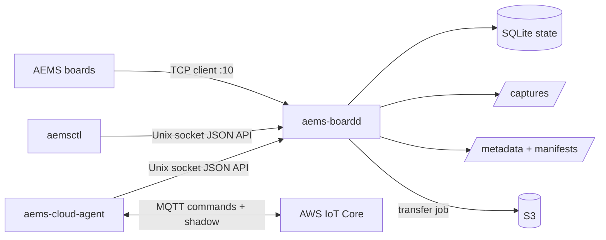

# Cloud Autonomy and AWS Integration

This page documents how the Raspberry Pi AEMS server can run autonomous DAQ locally and optionally bridge commands/health to AWS IoT Core and S3.

The important design rule is: board control stays local on the Pi. Cloud integration is a separate process that talks to the local daemon. If AWS credentials, MQTT, or internet connectivity fail, board TCP connections and local schedules can continue running.

## Process Responsibilities

| Process/tool | Required? | Responsibility |
|---|---|---|
| `aems-boardd` | yes on Raspberry Pi server | Owns TCP port `10`, accepts AEMS boards, stores board/job state, runs schedules, starts DAQ jobs, creates transfer manifests |
| `aemsctl` | yes for local control | Shell CLI that talks to `aems-boardd` through `/run/aems-server/aems-boardd.sock` |
| `aems-cloud-agent` | optional | AWS IoT Core bridge that converts MQTT commands into daemon API calls and publishes shadow updates |

`aems-cloud-agent` never talks directly to boards. It depends on `aems-boardd` being active.

## Architecture



## Installation Sequence On The Raspberry Pi

Run commands from the `BoardInterfaceLibrary` directory on the Pi.

### 1. Install daemon and CLI

```bash
sudo bash ./deploy/install_raspberry_pi.sh
```

The installer creates/configures:

- service user/group: `aems:aems`
- package virtualenv: `/opt/aems/venv`
- daemon executable: `/opt/aems/venv/bin/aems-boardd`
- CLI executable: `/opt/aems/venv/bin/aemsctl`
- cloud executable entry point: `/opt/aems/venv/bin/aems-cloud-agent`
- daemon unit: `/etc/systemd/system/aems-boardd.service`
- cloud unit: `/etc/systemd/system/aems-cloud-agent.service`
- daemon config: `/etc/aems-server/config.toml`
- cloud certificate directory: `/etc/aems-server/certs`
- daemon data root: `/var/lib/aems-server`
- captures: `/var/lib/aems-server/captures`
- metadata: `/var/lib/aems-server/metadata`
- manifests: `/var/lib/aems-server/manifests`

The installer enables and starts only `aems-boardd`. The cloud unit is installed but not enabled until AWS IoT credentials are configured.

Validate:

```bash
sudo systemctl status aems-boardd --no-pager
aemsctl server status
aemsctl boards --active
```

If `aemsctl` reports a socket permission error, log out and back in so your shell receives the `aems` group membership.

### 2. Install optional cloud dependencies

From the same `BoardInterfaceLibrary` directory:

```bash
sudo /opt/aems/venv/bin/pip install ".[cloud]"
```

This installs:

- `boto3` for S3 upload transfer jobs
- `awsiotsdk` / `awscrt` for AWS IoT Core MQTT and shadow publishing

Validate:

```bash
/opt/aems/venv/bin/aems-cloud-agent --help
/opt/aems/venv/bin/python -c "import boto3; import awscrt; print('cloud deps ok')"
```

### 3. Restart daemon after package updates

After reinstalling the package or changing daemon code:

```bash
sudo systemctl restart aems-boardd
sudo systemctl status aems-boardd --no-pager
```

If the firmware fixed-packet protocol changed, flash matching board firmware before using the updated daemon.

## Local Autonomous DAQ

Autonomous operation does not require AWS. The daemon can run schedules locally from SQLite.

### Daily live DAQ stream schedule

```bash
aemsctl schedule add morning-stream \
  --board all \
  --mode daq_stream \
  --start 02:00 \
  --duration 300 \
  --file-template "daq_{board_ip}_{date}.bin" \
  --format bin \
  --sample-rate 2000 \
  --channel-mask 0x3F \
  --block-samples 128
```

Live stream output is saved on the Pi under `/var/lib/aems-server/captures`. Metadata is saved under `/var/lib/aems-server/metadata`.

### Daily eMMC logging schedule

```bash
aemsctl schedule add morning-emmc-log \
  --board all \
  --mode daq_log \
  --start 03:00 \
  --duration 3600 \
  --file-template "emmc_{board_ip}_{date}.bin" \
  --sample-rate 2000 \
  --channel-mask 0x3F
```

For `daq_log`, the board writes data to its own eMMC. The daemon stores job ACK/status metadata under `/var/lib/aems-server/metadata`.

### Manage schedules

```bash
aemsctl schedules
aemsctl schedules --enabled
aemsctl schedule disable morning-stream
aemsctl schedule enable morning-stream
aemsctl schedule remove morning-stream
```

Template fields supported by `--file-template`:

- `{board_ip}`: board IP, for example `192.168.0.10`
- `{board}`: board IP with dots replaced by underscores
- `{site_id}`: configured site ID
- `{pi_id}`: configured Raspberry Pi ID
- `{date}`: local `YYYYMMDD`
- `{time}`: local `HHMMSS`
- `{datetime}`: local `YYYYMMDD_HHMMSS`

## Timed Jobs Without A Schedule

Start a timed live stream immediately:

```bash
aemsctl daq stream start --board all --file daq.bin --format bin --duration 300
```

Start a timed eMMC log immediately:

```bash
aemsctl daq log run --board all --file "daq_{board_ip}_{date}.bin" --duration 3600
```

Stop live stream jobs:

```bash
aemsctl daq stream stop
aemsctl daq stream stop --board 192.168.0.10
aemsctl daq stream stop --job-id <job_id>
```

## Health and Shadow Output

Local health:

```bash
aemsctl health --poll
```

AWS IoT shadow-compatible reported state:

```bash
aemsctl shadow --poll
```

The shadow document contains:

- `site_id`
- `pi_id`
- daemon uptime and paths
- storage capacity/free space
- active and historical boards
- last heartbeat/openamp/status responses
- active/recent DAQ jobs
- active/recent transfer jobs
- configured schedules

`aems-cloud-agent` publishes this payload to AWS IoT Device Shadow on:

```text
$aws/things/<thing-name>/shadow/update
```

## Transfer Jobs and Manifests

Transfer local captures/metadata/manifests to another folder:

```bash
aemsctl transfer start --target local --dest /mnt/usb/aems-upload
```

Transfer local captures/metadata/manifests to S3:

```bash
aemsctl transfer start \
  --target s3 \
  --bucket my-aems-data-bucket \
  --prefix site-001/pi-001/
```

List transfer jobs:

```bash
aemsctl transfers
aemsctl transfers --active
```

Each transfer creates a manifest under:

```text
/var/lib/aems-server/manifests
```

The manifest contains:

- transfer ID
- site ID
- Pi ID
- target
- file list
- byte counts
- SHA-256 for each file

The manifest is transferred last. Cloud ingestion can treat manifest arrival as the signal that all files listed in the manifest are available.

## AWS Resources Required From The End User

The repository does not create AWS resources automatically. You must provide the AWS pieces below.

### 1. AWS account and region

Choose the AWS region for IoT Core and S3, for example:

```text
us-east-1
```

Set this in `/etc/aems-server/config.toml`:

```toml
aws_region = "us-east-1"
```

### 2. S3 bucket and credentials

Create an S3 bucket for raw captures, metadata, and manifests.

Example config:

```toml
aws_s3_bucket = "my-aems-data-bucket"
aws_s3_prefix = "aems/site-001/pi-001/"
```

The `aems` user must have AWS credentials that allow S3 upload. Use one of:

- AWS CLI config for the `aems` user
- environment variables in a systemd drop-in
- IAM Roles Anywhere or another managed credential path

Minimum S3 permission shape:

```json
{
  "Effect": "Allow",
  "Action": ["s3:PutObject"],
  "Resource": "arn:aws:s3:::my-aems-data-bucket/aems/site-001/pi-001/*"
}
```

### 3. AWS IoT Thing and certificates

Create one IoT Thing for the Raspberry Pi, for example:

```text
aems-site-001-pi-001
```

Create/download:

- device certificate PEM
- private key PEM
- Amazon Root CA
- AWS IoT Core ATS endpoint

Install certificate files on the Pi:

```text
/etc/aems-server/certs/device.pem.crt
/etc/aems-server/certs/private.pem.key
/etc/aems-server/certs/AmazonRootCA1.pem
```

Recommended permissions:

```bash
sudo chown -R aems:aems /etc/aems-server/certs
sudo chmod 0750 /etc/aems-server/certs
sudo chmod 0640 /etc/aems-server/certs/*
```

### 4. AWS IoT policy

The IoT policy must allow the Pi to:

- connect as its thing/client ID
- subscribe to the command topic filter
- receive command topic messages
- publish command responses
- publish shadow updates

Topic pattern used by default:

```text
aems/<thing-name>/commands/#
aems/<thing-name>/responses
$aws/things/<thing-name>/shadow/update
```

The policy must cover both `iot:Subscribe` on the topic-filter ARN and `iot:Receive` on the topic ARN for the command topic. It also needs `iot:Publish` on the response topic and shadow update topic.

## Cloud Agent Configuration

Create:

```text
/etc/aems-server/cloud-agent.env
```

Example:

```bash
AEMS_AWS_IOT_ENDPOINT=xxxxxxxxxxxxxx-ats.iot.us-east-1.amazonaws.com
AEMS_AWS_THING_NAME=aems-site-001-pi-001
AEMS_AWS_CERT=/etc/aems-server/certs/device.pem.crt
AEMS_AWS_KEY=/etc/aems-server/certs/private.pem.key
AEMS_AWS_CA=/etc/aems-server/certs/AmazonRootCA1.pem
AEMS_AWS_TOPIC_PREFIX=aems/aems-site-001-pi-001
```

Secure the env file:

```bash
sudo chown root:aems /etc/aems-server/cloud-agent.env
sudo chmod 0640 /etc/aems-server/cloud-agent.env
```

Enable and start:

```bash
sudo systemctl daemon-reload
sudo systemctl enable aems-cloud-agent
sudo systemctl start aems-cloud-agent
sudo systemctl status aems-cloud-agent --no-pager
```

Logs:

```bash
journalctl -u aems-boardd -f
journalctl -u aems-cloud-agent -f
```

Manual run shape for debugging:

```bash
/opt/aems/venv/bin/aems-cloud-agent \
  --endpoint xxxxxxxxxxxxxx-ats.iot.us-east-1.amazonaws.com \
  --thing-name aems-site-001-pi-001 \
  --cert /etc/aems-server/certs/device.pem.crt \
  --key /etc/aems-server/certs/private.pem.key \
  --ca /etc/aems-server/certs/AmazonRootCA1.pem \
  --topic-prefix aems/aems-site-001-pi-001
```

Cloud agent behavior:

- `--topic-prefix` defaults to `aems/<thing-name>` if omitted.
- command subscription is `<topic-prefix>/commands/#`.
- command responses publish to `<topic-prefix>/responses`.
- shadow reported-state publishes every `--shadow-interval` seconds, default `30`.
- shadow topic is `$aws/things/<thing-name>/shadow/update`.
- payloads are JSON.
- unsupported commands are rejected and published as an error response.

## Cloud Commands

The cloud agent subscribes to:

```text
aems/<thing-name>/commands/#
```

Command payload shape:

```json
{
  "command": "daq.stream.start",
  "params": {
    "board": "all",
    "file": "daq_cloud.bin",
    "format": "bin",
    "duration": 300,
    "sample_rate": 2000,
    "channel_mask": 63,
    "block_samples": 128
  }
}
```

Supported command names:

- `health.get`
- `health.shadow`
- `daq.stream.start`
- `daq.stream.stop`
- `daq.log.start`
- `daq.log.stop`
- `daq.log.run`
- `transfer.start`
- `schedule.add`
- `schedule.remove`
- `schedule.enable`
- `boards.list`
- `jobs.list`
- `transfers.list`

Responses are published to:

```text
aems/<thing-name>/responses
```

Response shape:

```json
{
  "topic": "aems/aems-site-001-pi-001/commands/request-001",
  "request": {"command": "health.get", "params": {}},
  "result": {"ok": true, "data": {}}
}
```

## Current Board Limitation

The current firmware/tooling assumes channel mask `0x3F` for channels `0..5`. Keep cloud schedules and commands at `channel_mask = 63` unless the firmware and decoder are explicitly updated.
