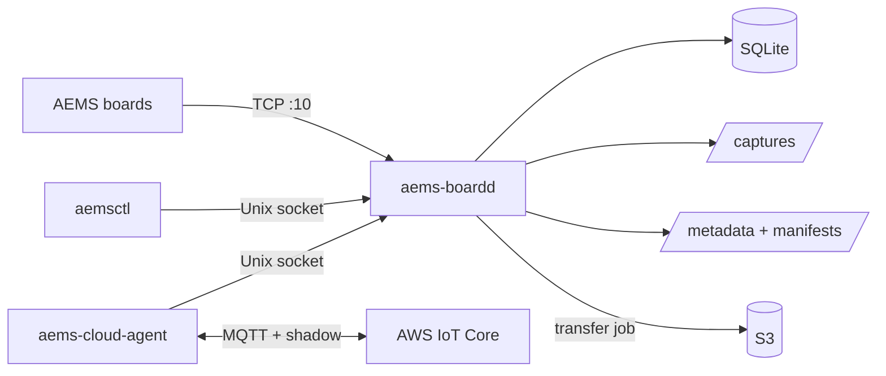

# Cloud Autonomy and AWS Integration

The Raspberry Pi server now has the local pieces required for autonomous DAQ:

- persistent board daemon: `aems-boardd`
- shell/API control: `aemsctl`
- durable SQLite state
- scheduled DAQ jobs
- timed eMMC DAQ log jobs
- timed live stream jobs
- transfer jobs with manifest generation
- health/shadow JSON output
- optional AWS IoT Core bridge: `aems-cloud-agent`

The design keeps hardware control local and puts cloud interaction in a separate
process. This prevents AWS credential or network failures from dropping board TCP
connections.

## Architecture



## Local Autonomous Schedules

Add a daily live stream schedule:

```bash
aemsctl schedule add morning-stream \
  --board all \
  --mode daq_stream \
  --start 02:00 \
  --duration 300 \
  --file-template "daq_{board_ip}_{date}.bin" \
  --format bin \
  --sample-rate 2000 \
  --channel-mask 0x3F \
  --block-samples 128
```

Add a daily eMMC logging schedule:

```bash
aemsctl schedule add morning-emmc-log \
  --board all \
  --mode daq_log \
  --start 03:00 \
  --duration 3600 \
  --file-template "emmc_{board_ip}_{date}.bin" \
  --sample-rate 2000 \
  --channel-mask 0x3F
```

Manage schedules:

```bash
aemsctl schedules
aemsctl schedules --enabled
aemsctl schedule disable morning-stream
aemsctl schedule enable morning-stream
aemsctl schedule remove morning-stream
```

Template fields:

- `{board_ip}`: board IP, for example `192.168.0.10`
- `{board}`: board IP with dots replaced by underscores
- `{site_id}`: configured site ID
- `{pi_id}`: configured Raspberry Pi ID
- `{date}`: local `YYYYMMDD`
- `{time}`: local `HHMMSS`
- `{datetime}`: local `YYYYMMDD_HHMMSS`

## Timed Jobs Without A Schedule

Start a timed live stream immediately:

```bash
aemsctl daq stream start --board all --file daq.bin --format bin --duration 300
```

Start a timed eMMC log immediately:

```bash
aemsctl daq log run --board all --file "daq_{board_ip}_{date}.bin" --duration 3600
```

## Health and Shadow Output

Local health:

```bash
aemsctl health --poll
```

AWS IoT shadow-compatible reported state:

```bash
aemsctl shadow --poll
```

The shadow document includes:

- `site_id`
- `pi_id`
- daemon uptime
- storage capacity/free space
- active and historical boards
- last heartbeat/openamp/status responses
- active/recent DAQ jobs
- active/recent transfer jobs
- schedules

This is the payload the cloud agent publishes to AWS IoT Device Shadow.

## Transfer Jobs and Manifests

Transfer local captures to another folder:

```bash
aemsctl transfer start --target local --dest /mnt/usb/aems-upload
```

Transfer local captures to S3:

```bash
aemsctl transfer start \
  --target s3 \
  --bucket my-aems-data-bucket \
  --prefix site-001/pi-001/
```

List transfer jobs:

```bash
aemsctl transfers
aemsctl transfers --active
```

Each transfer creates a manifest under:

```text
/var/lib/aems-server/manifests
```

The manifest contains:

- transfer ID
- site ID
- Pi ID
- target
- file list
- byte counts
- SHA-256 for each file

The manifest is transferred last. Cloud ingestion can treat manifest arrival as
the signal that all files listed in it are available.

## AWS Setup Required From The End User

You need to create/provide these AWS resources. The repository does not create
them automatically.

### 1. AWS Account and Region

Choose the AWS region for IoT Core and S3, for example:

```text
us-east-1
```

Set this in `/etc/aems-server/config.toml`:

```toml
aws_region = "us-east-1"
```

### 2. S3 Bucket

Create an S3 bucket for raw captures, metadata, and manifests.

Example:

```text
my-aems-data-bucket
```

Set:

```toml
aws_s3_bucket = "my-aems-data-bucket"
aws_s3_prefix = "aems/site-001/pi-001/"
```

The Pi also needs AWS credentials that allow `s3:PutObject`. Use one of:

- `aws configure` for the `aems` user
- environment variables in a systemd drop-in
- IAM Roles Anywhere or another managed credential path

Minimum S3 policy shape:

```json
{
  "Effect": "Allow",
  "Action": ["s3:PutObject"],
  "Resource": "arn:aws:s3:::my-aems-data-bucket/aems/site-001/pi-001/*"
}
```

### 3. AWS IoT Thing

Create one IoT Thing for the Raspberry Pi, for example:

```text
aems-site-001-pi-001
```

Create and download:

- device certificate PEM
- private key PEM
- Amazon Root CA
- AWS IoT Core endpoint

Install these on the Pi, readable only by the `aems` user:

```text
/etc/aems-server/certs/device.pem.crt
/etc/aems-server/certs/private.pem.key
/etc/aems-server/certs/AmazonRootCA1.pem
```

### 4. AWS IoT Policy

Attach a policy that allows the Pi to:

- connect as its thing/client ID
- publish shadow updates
- subscribe to command topics
- publish command responses

Example topic pattern:

```text
aems/aems-site-001-pi-001/commands/#
aems/aems-site-001-pi-001/responses
$aws/things/aems-site-001-pi-001/shadow/update
```

### 5. Install Cloud Dependencies

On the Pi:

```bash
cd ~/AEMSv02Interface
sudo /opt/aems/venv/bin/pip install ".[cloud]"
```

Or reinstall everything:

```bash
sudo /opt/aems/venv/bin/pip install ".[daemon,cloud]"
```

### 6. Configure Cloud Agent Environment

Create:

```text
/etc/aems-server/cloud-agent.env
```

Example:

```bash
AEMS_AWS_IOT_ENDPOINT=xxxxxxxxxxxxxx-ats.iot.us-east-1.amazonaws.com
AEMS_AWS_THING_NAME=aems-site-001-pi-001
AEMS_AWS_CERT=/etc/aems-server/certs/device.pem.crt
AEMS_AWS_KEY=/etc/aems-server/certs/private.pem.key
AEMS_AWS_CA=/etc/aems-server/certs/AmazonRootCA1.pem
AEMS_AWS_TOPIC_PREFIX=aems/aems-site-001-pi-001
```

Then install/enable the optional service:

```bash
sudo cp deploy/systemd/aems-cloud-agent.service /etc/systemd/system/
sudo systemctl daemon-reload
sudo systemctl enable aems-cloud-agent
sudo systemctl start aems-cloud-agent
```

## Cloud Commands

The cloud agent subscribes to:

```text
aems/<thing-name>/commands/#
```

Command payload:

```json
{
  "command": "daq.stream.start",
  "params": {
    "board": "all",
    "file": "daq_cloud.bin",
    "format": "bin",
    "duration": 300,
    "sample_rate": 2000,
    "channel_mask": 63,
    "block_samples": 128
  }
}
```

Other useful command names:

- `health.get`
- `health.shadow`
- `daq.stream.stop`
- `daq.log.run`
- `transfer.start`
- `schedule.add`
- `schedule.remove`
- `schedule.enable`
- `boards.list`
- `jobs.list`
- `transfers.list`

Responses are published to:

```text
aems/<thing-name>/responses
```

## Current Board Limitation

The current firmware/tooling assumes channel mask `0x3F` for channels `0..5`.
Keep cloud schedules and commands at `channel_mask = 63` unless the firmware and
decoder are explicitly updated.
