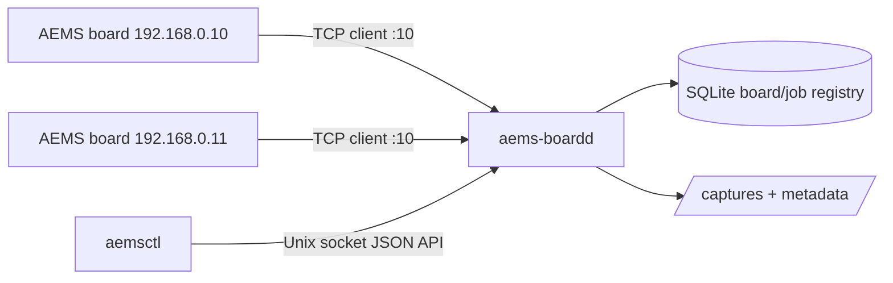

# Raspberry Pi Permanent Server

The Raspberry Pi server mode runs one permanent process that listens for AEMS
boards on TCP port `10`. Boards connect as TCP clients when they are powered or
reconnected. Users then control those boards locally through the `aemsctl` shell
command.

This is separate from normal library usage. You can still install and import
`board_interface` from Windows, macOS, or Linux for direct scripting.

## Architecture



## Installed Paths

Default Raspberry Pi paths:

- Config: `/etc/aems-server/config.toml`
- Database: `/var/lib/aems-server/aems.db`
- Captures: `/var/lib/aems-server/captures`
- Metadata: `/var/lib/aems-server/metadata`
- Local API socket: `/run/aems-server/aems-boardd.sock`

## Install

From the `BoardInterfaceLibrary` directory on the Raspberry Pi:

```bash
sudo bash ./deploy/install_raspberry_pi.sh
```

The installer:

- creates the `aems` system user
- creates the `aems` group and adds the sudo user to it when possible
- creates `/var/lib/aems-server`
- installs the package into `/opt/aems/venv`
- installs `/etc/aems-server/config.toml`
- installs and enables `aems-boardd.service`

Log out and back in after install if `aemsctl` reports socket permission errors.

## Service Control

```bash
sudo systemctl status aems-boardd
sudo systemctl restart aems-boardd
sudo journalctl -u aems-boardd -f
```

TCP port `10` is privileged on Linux. The systemd unit grants only
`CAP_NET_BIND_SERVICE`, so the Python daemon can bind port `10` without running
the whole process as root.

## Runtime Model

- `aems-boardd` owns TCP port `10`.
- Each board is keyed by IP address for now.
- The daemon stores board first-seen, last-seen, active state, connection count,
  and recent responses in SQLite.
- `aemsctl` never opens TCP port `10`; it talks to `/run/aems-server/aems-boardd.sock`.
- Long-running DAQ streams run as daemon jobs, not foreground shell processes.

## Common Commands

```bash
aemsctl server status
aemsctl boards
aemsctl boards --active
aemsctl jobs
aemsctl jobs --active
```

Single-board checks:

```bash
aemsctl board 192.168.0.10 heartbeat
aemsctl board 192.168.0.10 openamp
aemsctl board 192.168.0.10 status
```

Multi-board DAQ stream:

```bash
aemsctl daq stream start --board all --file daq.bin --format bin --duration 30
aemsctl jobs --active
```

Manual stop:

```bash
aemsctl daq stream stop --board 192.168.0.10
aemsctl daq stream stop
```

eMMC DAQ log:

```bash
aemsctl daq log start --board 192.168.0.10 --file daq.bin --sample-rate 2000 --channel-mask 0x3F
aemsctl daq log stop --board 192.168.0.10
```

## Metadata

DAQ stream jobs write a metadata JSON file next to the output file. It includes:

- board IP
- requested DAQ config
- command `13` stream result
- command `12` stop ACK
- command `10` DAQ status
- throughput metrics
- dropped-buffer estimates

## Current Board Limitation

The current board firmware is limited to channel mask `0x3F`, meaning channels
`0..5` are active. The daemon and CLI allow the channel mask to be passed through,
but current production usage should keep `--channel-mask 0x3F`.

## Troubleshooting

If `aemsctl` cannot connect:

```bash
sudo systemctl status aems-boardd
ls -l /run/aems-server/aems-boardd.sock
sudo journalctl -u aems-boardd -n 100
```

If no boards are active:

- confirm the Raspberry Pi Ethernet interface is on the same subnet
- confirm no other process owns TCP port `10`
- power-cycle or reset the board
- check `aemsctl boards` for previous connection timestamps

If DAQ stream jobs remain running:

```bash
aemsctl jobs --active
aemsctl daq stream stop
```
