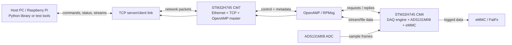
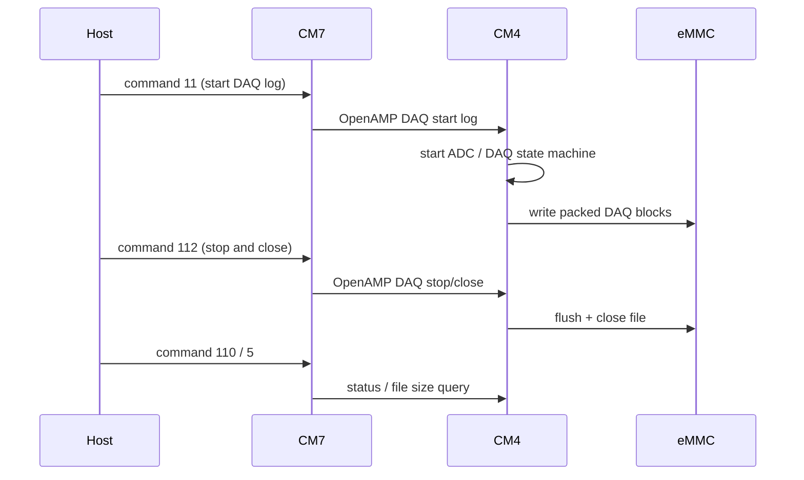
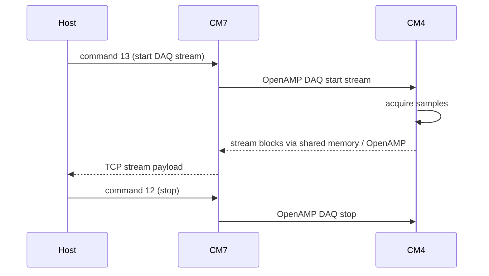
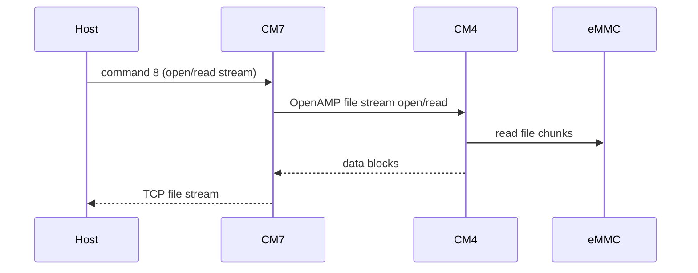

# AEMSv02-Firmware

Firmware and host-side tooling for the AEMS v2 board.

This repository contains:
- embedded firmware for the STM32H745 dual-core target
- CM4 DAQ, ADC, and eMMC ownership code
- CM7 Ethernet/TCP, OpenAMP, and host command handling code
- a Python board interface library for single-board and multi-board control
- software documentation for the firmware architecture

## What this repo is trying to do

At a high level, the board measures analog electrical signals, converts them through the ADS131M08 acquisition path, and then makes that data available in two main ways:

- log DAQ data to eMMC on the board
- stream DAQ or file data back to a host over TCP

The repository is structured around the hardware split of the STM32H745:

- `CM4` owns deterministic acquisition and storage work
- `CM7` owns network communication and command/control

That split is intentional. It keeps time-sensitive data capture close to the ADC/eMMC side, while the network-facing logic remains isolated on the Ethernet-enabled core.

## System overview

## High-level runtime model

### CM4 responsibilities

CM4 is the real-time acquisition and storage side.

It is responsible for:
- configuring and reading the ADS131M08
- running the DAQ state machine
- managing DAQ sample packing
- writing DAQ data to eMMC through FatFs
- exposing DAQ/file operations to CM7 through OpenAMP
- applying persisted channel offset calibration during DAQ startup

### CM7 responsibilities

CM7 is the communication and orchestration side.

It is responsible for:
- Ethernet and TCP handling
- receiving commands from the host
- translating host commands into OpenAMP operations
- returning status and acknowledgements over TCP
- serving file streams and DAQ streams back to the host

### Host responsibilities

The host side in this repo is the Python library in `BoardInterfaceLibrary`.

It is responsible for:
- acting as the TCP server that boards connect to
- handling single-board and multi-board sessions
- parsing board responses into stable dictionaries / dataclasses
- decoding DAQ stream and DAQ log binary formats
- converting raw ADC values into physical voltage/current values
- providing examples, CLI tooling, and simple GUIs

## Main workflows

### 1. Log DAQ data to eMMC

### 2. Stream DAQ data live

### 3. Read back a file from eMMC

## Repository layout

Top-level directories:

- `CM4`
  - Cortex-M4 firmware project content
  - DAQ engine, ADS131M08 integration, eMMC/FatFs, OpenAMP remote service
- `CM7`
  - Cortex-M7 firmware project content
  - Ethernet/TCP handling, FreeRTOS tasks, OpenAMP master side
- `Common`
  - shared headers and cross-core data structures
- `BoardInterfaceLibrary`
  - Python package for controlling one or more boards from a host
- `UnitTests`
  - direct test scripts such as `tcptest.py`
- `docs`
  - software documentation for architecture and library internals
- `Drivers`
  - STM32 HAL and CMSIS driver code
- `Middlewares`
  - FatFs, OpenAMP, libmetal, and related middleware
- `datasheets`
  - hardware reference material used during firmware work

Key root files:

- `AEMSv02-Firmware.ioc`
  - STM32CubeMX project configuration
- `.project`, `.mxproject`, `.settings`
  - STM32CubeIDE project metadata

## Where to start, depending on what you are doing

### If you are working on embedded acquisition or storage

Start with:
- `CM4`
- `docs/Software/CM4/README.md`
- `docs/Software/CM4/Library/ads131m08.md`
- `docs/Software/CM4/Library/emmc_fs.md`

### If you are working on Ethernet, TCP, or host command flow

Start with:
- `CM7`
- `docs/Software/CM7/README.md`
- `docs/Software/CM7/Library/tcpclient.md`
- `docs/Software/CM7/Library/openamp_master.md`

### If you are building host tools, automation, or multi-board workflows

Start with:
- `BoardInterfaceLibrary/README.md`
- `BoardInterfaceLibrary/examples/README.md`
- `BoardInterfaceLibrary/board_interface/session.py`
- `BoardInterfaceLibrary/board_interface/response_parser.py`

### If you need the overall firmware architecture first

Start with:
- `docs/Software/README.md`

## How people use this repo

There are usually three usage modes.

### Firmware development

Typical users:
- embedded developers working in STM32CubeIDE

They use this repo to:
- build and flash CM4/CM7 firmware
- modify DAQ behavior
- update command handling
- change hardware bring-up or storage behavior

### Board bring-up and bench validation

Typical users:
- firmware developers
- test engineers

They use:
- `UnitTests/tcptest.py`
- `BoardInterfaceLibrary/examples`

Common actions:
- verify heartbeat and OpenAMP connectivity
- start/stop DAQ logging
- stream files back from eMMC
- view live RMS values in a host GUI during DAQ streaming
- inspect DAQ status and throughput
- run offset calibration

## RGB LED Status Guide

The onboard RGB LED is driven by CM7 and gives a quick visual status of the board. The LED is useful when several boards are connected to a switch and the host is not yet running.

| LED | Board status | What to do |
|---|---|---|
| White solid | Booting | Firmware has started and initialization is in progress. |
| Blue slow blink | Ethernet / PHY init | LAN8742 PHY reset, Ethernet MAC/PHY bring-up, or no stable link yet. Check cable/switch if it stays here. |
| Blue solid | Ethernet link up, TCP not connected | Board has link but has not connected to the Python host server. Start the host server and check host IP/port. |
| Green solid | TCP connected / idle | Board is connected to the host and ready for commands. |
| Yellow blink | CM4 / OpenAMP not ready | CM7 is alive, but CM4/OpenAMP service is not healthy yet. Run command `99` for detail. |
| Red slow blink | eMMC error | Storage is unavailable or mount failed. Run command `99` and inspect eMMC mount diagnostics. |
| Purple slow blink | eMMC formatting | Blank eMMC was detected and filesystem creation is in progress. Wait for it to finish. |
| Cyan pulse | DAQ logging to eMMC | Command `11` DAQ capture is active and writing to eMMC. |
| Green fast blink | Live DAQ streaming | Command `13` live stream is active over TCP. |
| Cyan fast blink | File streaming | Command `8` file readback stream is active. |
| Yellow solid | Offset calibration | Command `98` offset calibration is running. |
| Orange blink | Recoverable warning | Nonfatal issue such as dropped samples, command failure, stream start failure, or retry condition. Query status. |
| Red solid | Fatal error | Firmware entered `Error_Handler()`. Reset/debug the board. |

Priority is error-first. For example, an eMMC error overrides the normal green connected state.

### Host-side application and automation development

Typical users:
- Python application developers
- lab automation developers
- Raspberry Pi / laptop control software developers

They use:
- `BoardInterfaceLibrary`

Common actions:
- control one or more boards simultaneously
- decode DAQ streams
- convert binary DAQ data to physical values
- build live monitoring tools on top of the Python session API
- build higher-level monitoring or acquisition applications

### Raspberry Pi permanent server deployment

Typical users:
- lab users who want a Pi to always listen for any plugged-in AEMS board
- automation systems that need shell-level control instead of foreground Python scripts

They use:
- `BoardInterfaceLibrary` installed with daemon support
- `aems-boardd` as a systemd service
- `aemsctl` as the shell control command

Common actions:
- list active and historical boards
- start/stop DAQ streams on one board or all boards
- start/stop eMMC DAQ logs
- run local schedules for daily autonomous DAQ
- publish health/shadow JSON for cloud monitoring
- transfer capture bundles and manifests to local storage or S3
- query eMMC files and board status
- persist capture metadata under `/var/lib/aems-server`

## Current documentation entry points

- Firmware overview: `docs/Software/README.md`
- CM4 firmware docs: `docs/Software/CM4/README.md`
- CM7 firmware docs: `docs/Software/CM7/README.md`
- Python host library: `BoardInterfaceLibrary/README.md`
- Python examples: `BoardInterfaceLibrary/examples/README.md`
- Raspberry Pi server: `BoardInterfaceLibrary/docs/raspberry_pi_server.md`
- Raspberry Pi CLI: `BoardInterfaceLibrary/docs/aemsctl.md`
- Cloud/autonomous operation: `BoardInterfaceLibrary/docs/cloud_autonomy.md`

## Practical setup flow

For a new developer or user, the practical order is:

1. Understand the system split in `docs/Software/README.md`
2. Build/flash the firmware from STM32CubeIDE
3. Use `UnitTests/tcptest.py` or the Python examples to confirm board connectivity
4. Use `BoardInterfaceLibrary` for repeatable host-side control and streaming workflows

## Notes

- The current board/firmware assumptions in the Python tooling are built around a 6-channel mask of `0x3F` for the active acquisition workflows.
- CM4 is the authority for ADC capture, offset calibration, and eMMC writes.
- CM7 is the authority for TCP command handling and transport.
