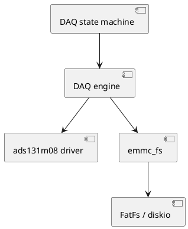

# CM4 Libraries

This section documents the CM4 libraries that implement the acquisition and storage plane.

## Library overview

| Library | Source path | Purpose |
|---|---|---|
| `ads131m08` | `CM4/Library/ads131m08` | ADS131M08 driver, DAQ engine, and DAQ state machine |
| `emmc_fs` | `CM4/Library/emmc_fs` | FatFs wrapper, file enumeration, chunk reads, raw log writes |
| `openamp_fs` | `CM4/Core/Src/openamp_fs.c` | CM4-side OpenAMP remote service that exposes DAQ and filesystem operations |

## Relationship between the libraries

## Reading order

1. Start with [ads131m08 / DAQ engine](ads131m08.md) to understand how samples are acquired and packed.
2. Then read [eMMC filesystem wrapper](emmc_fs.md) to understand how those bytes reach storage and how CM7 later retrieves them.
3. Read [OpenAMP remote service](openamp_remote.md) to understand how CM7 reaches CM4 functionality.
