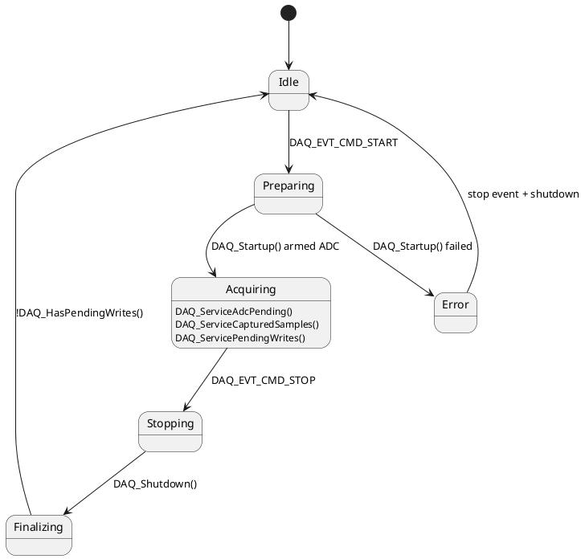

# CM4 Library: ads131m08 and DAQ Engine

## Scope

This library cluster contains three closely related pieces of functionality:

1. low-level ADS131M08 SPI/DMA driver support
2. DAQ engine logic that converts ADC frames into queued samples
3. DAQ state machine that controls acquisition lifecycle

## Source files

| File | Role |
|---|---|
| `CM4/Library/ads131m08/ads131m08.c` | low-level ADC device and DMA integration |
| `CM4/Library/ads131m08/ads131m08.h` | ADS131M08 register definitions and driver API |
| `CM4/Library/ads131m08/daq_engine.c` | DAQ buffering, packing, streaming, write path |
| `CM4/Library/ads131m08/daq_engine.h` | DAQ engine public API |
| `CM4/Library/ads131m08/statemachine.c` | superloop DAQ state machine |
| `CM4/Library/ads131m08/statemachine.h` | DAQ event and state machine API |

## High-level responsibilities

### ADS driver layer

The ADS driver layer is responsible for:

- device register access
- device ID detection
- SPI frame formatting
- DMA read orchestration
- extracting raw channel data from completed DMA frames

### DAQ engine layer

The DAQ engine is responsible for:

- validating DAQ configuration
- starting/stopping logging or streaming modes
- accumulating ADC samples into write blocks
- queueing blocks for output
- packing eMMC file payloads
- exposing status counters

### State machine layer

The state machine ensures that acquisition transitions are orderly and nonblocking.

## Important shared data structures

### `DaqSampleFrame_t`

Defined in `Common/Inc/daq_shared.h`.

```c
typedef struct
{
  uint16_t response;
  uint16_t crc;
  int32_t channel[DAQ_CHANNEL_COUNT];
} DaqSampleFrame_t;
```

This is the canonical in-memory DAQ frame.

### `DaqConfig_t`

Carries runtime DAQ configuration:

| Field | Meaning |
|---|---|
| `sample_rate_hz` | requested logical sample rate |
| `channel_mask` | bitmask of channels to include |
| `block_samples` | aggregation block size |
| `flags` | reserved runtime flags |
| `filename` | target log filename for command `11` |

### `DaqStatus_t`

Carries CM4 status back to CM7:

| Field | Meaning |
|---|---|
| `state` | DAQ runtime state |
| `mode` | idle / log / stream |
| `last_error` | latched DAQ error code |
| `samples_captured` | total samples accepted by the DAQ engine |
| `dropped_buffers` | queue/write path drops |
| `bytes_queued` | pending output bytes |
| `bytes_written` | output bytes committed |
| `adc_ready_pending` | pending DRDY-derived service count |

## Function-level reference

### `void DAQ_EngineInit(void)`

Initializes DAQ software state and establishes idle defaults.

Effects:
- clears software buffers
- resets pending counters
- sets default sample rate, channel mask, and block size
- forces raw log closed state
- shuts down the ADC master clock

### `uint8_t DAQ_ApplyConfig(const DaqConfig_t *cfg)`

Validates and stores the next DAQ configuration.

Arguments:
- `cfg`: candidate DAQ configuration

Returns:
- `1` if configuration is valid
- `0` otherwise

Validation currently checks:
- non-null config
- nonzero sample rate
- channel mask within 8-bit range
- block size in supported range
- null-terminated filename

### `const DaqConfig_t *DAQ_GetConfig(void)`

Returns the currently applied DAQ configuration.

### `uint8_t DAQ_StartLogging(const DaqConfig_t *cfg)`

Starts DAQ in **eMMC logging mode**.

Arguments:
- `cfg`: DAQ configuration

Behavior:
- validates and stores config
- opens a raw log file through `EmmcFs_OpenRawLog()`
- resets counters and queues
- sets mode to `DAQ_MODE_LOG_TO_EMMC`
- posts `DAQ_EVT_CMD_START`

### `uint8_t DAQ_StartStreaming(const DaqConfig_t *cfg)`

Starts DAQ in **shared-memory streaming mode**.

Arguments:
- `cfg`: DAQ configuration

Behavior:
- validates and stores config
- resets counters and queues
- sets mode to `DAQ_MODE_STREAM_TO_SHMEM`
- posts `DAQ_EVT_CMD_START`

### `void DAQ_Stop(void)`

Requests stop for the current DAQ session.

Behavior:
- if already idle or error, resets software buffers immediately
- otherwise posts `DAQ_EVT_CMD_STOP`

### `uint8_t DAQ_StopAndClose(void)`

Forces shutdown/finalization and ensures pending writes are drained before returning to idle.

Used by command `112` close/stop flows.

### `void DAQ_GetStatus(DaqStatus_t *status)`

Copies the current runtime status into the supplied output structure.

Arguments:
- `status`: destination status object

### `uint8_t DAQ_ReadStreamBlockShared(...)`

```c
uint8_t DAQ_ReadStreamBlockShared(uint8_t **buffer,
                                  uint16_t max_len,
                                  uint16_t *bytes_read,
                                  uint32_t *samples_read);
```

Returns one queued shared-memory DAQ block to CM7.

Arguments:
- `buffer`: output pointer to shared SRAM region
- `max_len`: maximum number of bytes CM7 can accept
- `bytes_read`: number of valid bytes returned
- `samples_read`: number of DAQ samples represented

In stream mode this path copies full `DaqSampleFrame_t` objects into shared memory.

### `void DAQ_Startup(void)`

Brings up the ADS131M08 acquisition path.

Behavior includes:
- enabling the ADC master clock
- device startup
- configuring ADS clock/OSR according to requested sample rate
- writing PGA gains
- applying calibration values
- arming DAQ context

### `void DAQ_Shutdown(void)`

Stops acquisition, drains remaining captured samples into queued blocks, and leaves final file closure to later finalization logic.

### `uint32_t DAQ_ServiceAdcPending(uint32_t max_events)`

Consumes pending DRDY events and tries to start DMA reads.

Arguments:
- `max_events`: upper bound of service attempts for this call

Returns:
- number of DMA read launches performed

### `uint32_t DAQ_ServiceCapturedSamples(uint32_t max_samples)`

Consumes completed DMA frames and stores them as DAQ samples.

Arguments:
- `max_samples`: upper bound of completed DMA frames to process

Returns:
- number of raw frames processed

### `void DAQ_ServicePendingWrites(void)`

Processes one queued aggregation block.

Behavior in log mode:
- pack selected channels into `emmc_pack_buffer`
- write packed bytes using `EmmcFs_WriteRawLog()`
- update `bytes_written`
- increment error/drop counters on failure

### `uint8_t DAQ_HasPendingWrites(void)`

Returns whether the output pipeline still has queued or partial data pending.

## eMMC log packing details

The most important detail in this library is that **log mode and stream mode do not write the same byte layout**.

### Log mode packing function

The relevant function is `DAQ_PackBlockSelectedChannels()`.

Behavior:
- iterate sample by sample
- iterate channel by channel in ascending order
- include only channels enabled in `g_daq_cfg.channel_mask`
- write each selected channel as signed 32-bit little-endian via `DAQ_WriteS32Le()`

For current firmware assumptions (`channel_mask = 0x3F`):

| Per-sample bytes | Meaning |
|---|---|
| bytes 0..3 | `ch0` as `int32_le` |
| bytes 4..7 | `ch1` as `int32_le` |
| bytes 8..11 | `ch2` as `int32_le` |
| bytes 12..15 | `ch3` as `int32_le` |
| bytes 16..19 | `ch4` as `int32_le` |
| bytes 20..23 | `ch5` as `int32_le` |

Total: **24 bytes/sample**.

### Stream mode packing

Stream mode does not repack channels. It returns full `DaqSampleFrame_t` objects, total **36 bytes/frame**.

## DAQ state machine API

### `void DAQ_ContextInit(void)`

Resets the runtime context (`g_daq_ctx`) to a known idle state.

### `void DAQ_StateMachine_Run(void)`

Executes one cooperative iteration of the DAQ lifecycle state machine. This function is meant to be called continuously from the CM4 superloop.

## State machine flow



## Notes for maintainers

- if channel mask support is widened beyond `0x3F`, the command `11` binary log layout changes immediately
- any host parser consuming eMMC `.bin` files must track the same packing rules as `DAQ_PackBlockSelectedChannels()`
- command `13` parsers must continue to use full-frame decoding
