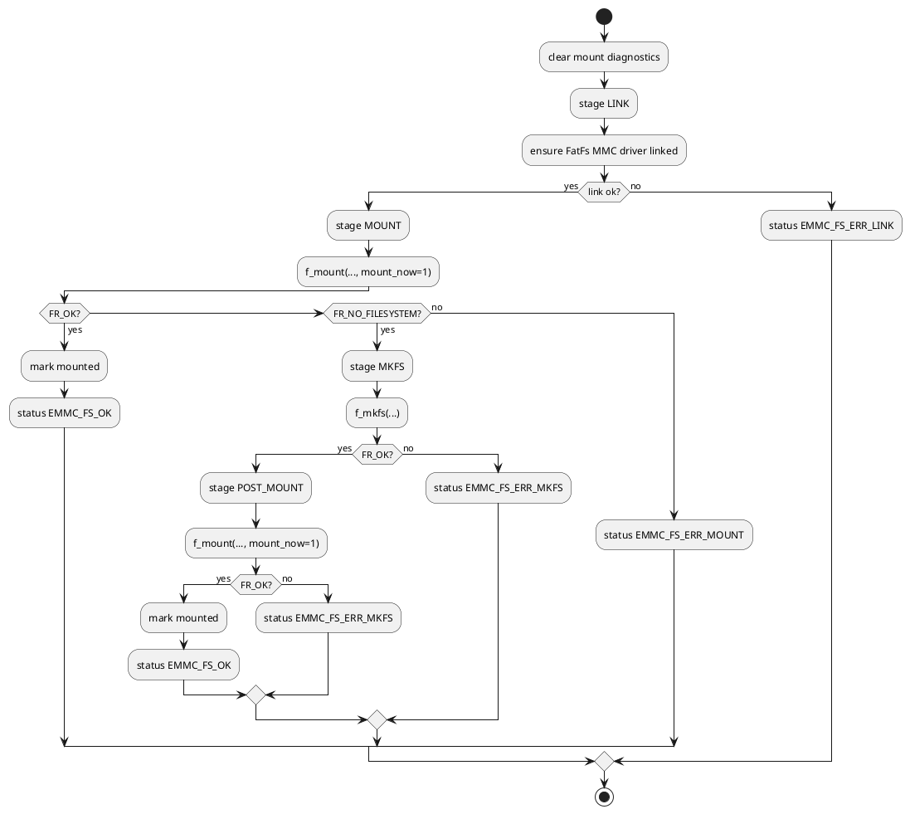
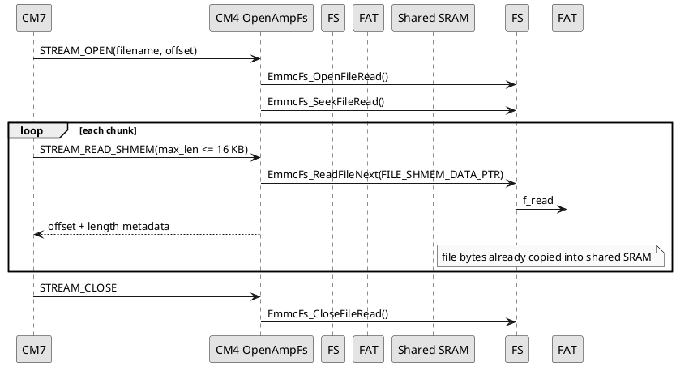
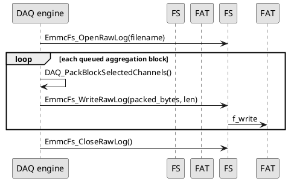

# CM4 Library: emmc_fs

## Scope

`emmc_fs` is the CM4-side filesystem wrapper around FatFs. It is the high-level storage API used by the current firmware to mount, format, enumerate, read, delete, and write files on the eMMC volume.

CM4 owns this subsystem. CM7 never mounts the eMMC volume directly; CM7 reaches storage through OpenAMP RPCs into CM4.

## Source files

| File | Role |
|---|---|
| `CM4/Library/emmc_fs/emmc_fs.h` | public API, status codes, mount diagnostics, read/write handle types |
| `CM4/Library/emmc_fs/emmc_fs.c` | FatFs wrapper implementation |
| `CM4/Core/Src/mmc_diskio.c` | FatFs disk I/O glue to SDMMC1/MMC |
| `CM4/Core/Inc/sdmmc.h` | SDMMC1 ClockDiv policy constants and helper prototypes |
| `CM4/Core/Src/sdmmc.c` | generated SDMMC1 init plus USER CODE ClockDiv helpers |
| `CM4/Core/Src/main.c` | boot-time eMMC init/mount sequence and mount diagnostic snapshot |
| `CM4/FATFS/App/fatfs.c` | generated FatFs integration |
| `CM4/FATFS/Target/user_diskio.c` | generated target disk I/O wrapper |

## High-level responsibilities

`emmc_fs` provides:

- FatFs driver link and mount-or-format lifecycle
- mount/format diagnostics for command `99`
- file counting and file listing with sizes
- file size queries
- one-shot file chunk reads
- persistent open/read/close handles for high-throughput file streaming
- delete all `.bin` / `.dat` files and delete-one-file operations
- generic file write handles
- raw DAQ log open/write/close helpers
- deterministic pattern-file creation for transport/file tests
- config file write/read helpers for `config_main.conf`

All public API entry points serialize FatFs access with the eMMC filesystem HSEM lock (`HSEM_FS_API_ID`).

## Status model

`EmmcFsStatus_t` defines the public error contract returned by the wrapper.

| Symbol | Value | Meaning |
|---|---:|---|
| `EMMC_FS_OK` | `0` | success |
| `EMMC_FS_ERR_PARAM` | `-1` | invalid input pointer/argument |
| `EMMC_FS_ERR_LINK` | `-2` | FatFs driver link failed |
| `EMMC_FS_ERR_MOUNT` | `-3` | mount failed for a reason other than missing filesystem |
| `EMMC_FS_ERR_NO_FS` | `-4` | no filesystem present |
| `EMMC_FS_ERR_MKFS` | `-5` | format or post-format mount failed |
| `EMMC_FS_ERR_OPEN_DIR` | `-6` | directory open failed |
| `EMMC_FS_ERR_READ_DIR` | `-7` | directory enumeration or related read failed |
| `EMMC_FS_ERR_OPEN_FILE` | `-8` | file open failed |
| `EMMC_FS_ERR_READ_FILE` | `-9` | file read/write/seek/sync/close failed |
| `EMMC_FS_ERR_BUFFER_SMALL` | `-10` | caller buffer too small |

FatFs `FRESULT` values are also exposed in diagnostics for mount/format debugging. Important values seen during bring-up:

| FRESULT | Value | Meaning |
|---|---:|---|
| `FR_OK` | `0` | operation succeeded |
| `FR_DISK_ERR` | `1` | low-level disk I/O error |
| `FR_NOT_READY` | `3` | disk not ready |
| `FR_NO_FILE` | `4` | file not found |
| `FR_NO_PATH` | `5` | path not found |
| `FR_DENIED` | `7` | access denied or object exists depending on operation |
| `FR_EXIST` | `8` | object already exists |
| `FR_NO_FILESYSTEM` | `13` | valid disk, but no FAT filesystem |
| `FR_MKFS_ABORTED` | `14` | filesystem creation aborted |
| `FR_TIMEOUT` | `15` | timeout while waiting for access |
| `FR_INVALID_PARAMETER` | `19` | invalid FatFs parameter |

## Mount/format lifecycle

`EmmcFs_MountOrFormat()` is the authoritative boot-time mount path. It performs this sequence:



Expected first-boot behavior on a blank eMMC:

1. first `f_mount()` returns `FR_NO_FILESYSTEM` (`13`)
2. firmware runs `f_mkfs()`
3. post-format `f_mount()` returns `FR_OK`
4. public mount status is still `EMMC_FS_OK`

That means a healthy newly formatted board can report:

```text
remote_mount_status=0,
emmc_mount_stage=4,
emmc_mount_fresult=13,
emmc_mkfs_fresult=0,
emmc_post_mount_fresult=0
```

This is not an error. It records that the initial mount found no filesystem, created one, then mounted successfully.

## SDMMC1 ClockDiv policy

Some blank eMMC parts are more reliable during first filesystem creation at a slower SDMMC clock. The current policy is implemented in USER CODE blocks so CubeMX regeneration does not wipe it:

| Constant | Value | Purpose |
|---|---:|---|
| `SDMMC1_EMMC_MOUNT_CLOCK_DIV` | `10` | used before `EmmcFs_Init()` and `EmmcFs_MountOrFormat()` |
| `SDMMC1_EMMC_RUNTIME_CLOCK_DIV` | `8` | restored after a successful mount/format |

Boot sequence in `CM4/Core/Src/main.c`:

```c
(void)SDMMC1_SetClockDiv(SDMMC1_EMMC_MOUNT_CLOCK_DIV);
g_cm4_emmc_init_status = (int32_t)EmmcFs_Init();
g_cm4_emmc_mount_status = (int32_t)EmmcFs_MountOrFormat();
EmmcFs_GetMountDiagnostics(&g_cm4_emmc_mount_diag);
if (g_cm4_emmc_mount_status == EMMC_FS_OK)
{
  (void)SDMMC1_SetClockDiv(SDMMC1_EMMC_RUNTIME_CLOCK_DIV);
  (void)DAQ_LoadOffsetCalibration();
}
```

Implementation details:

- `SDMMC1_SetClockDiv()` updates both `hmmc1.Init.ClockDiv` and `SDMMC1->CLKCR.CLKDIV`.
- `SDMMC1_GetClockDiv()` reads the active hardware CLKDIV field.
- The constants and prototypes live in `CM4/Core/Inc/sdmmc.h` inside CubeMX USER CODE sections.
- The helper implementations live in `CM4/Core/Src/sdmmc.c` inside `USER CODE BEGIN 1` / `USER CODE END 1`.
- The policy keeps generated `MX_SDMMC1_MMC_Init()` unchanged; CubeMX can still regenerate SDMMC setup safely.

## Mount diagnostics model

`EmmcFsMountDiagnostics_t` is the CM4 snapshot for the most recent mount-or-format attempt:

```c
typedef struct
{
    uint32_t stage;
    int32_t status;
    uint32_t mount_fresult;
    uint32_t mkfs_fresult;
    uint32_t post_mount_fresult;
} EmmcFsMountDiagnostics_t;
```

Stages are reported as `EmmcFsMountStage_t`:

| Stage | Value | Meaning |
|---|---:|---|
| `EMMC_FS_MOUNT_STAGE_NONE` | `0` | no mount attempt recorded |
| `EMMC_FS_MOUNT_STAGE_LINK` | `1` | linking FatFs disk driver |
| `EMMC_FS_MOUNT_STAGE_MOUNT` | `2` | first `f_mount()` attempt |
| `EMMC_FS_MOUNT_STAGE_MKFS` | `3` | filesystem creation with `f_mkfs()` |
| `EMMC_FS_MOUNT_STAGE_POST_MOUNT` | `4` | mount after successful format |

`EmmcFs_GetMountDiagnostics(EmmcFsMountDiagnostics_t *diagnostics)` copies this snapshot under the filesystem HSEM lock. CM4 stores the boot snapshot in `g_cm4_emmc_mount_diag` immediately after `EmmcFs_MountOrFormat()`.

### How diagnostics reach the host

CM4 includes mount diagnostics in the default OpenAMP small response fields:

| OpenAMP response field | Meaning |
|---|---|
| `arg1` | `emmc_mount_stage` |
| `arg2` | first-mount FatFs `FRESULT` |
| `arg3` | `f_mkfs()` FatFs `FRESULT` |
| `arg4` | post-format-mount FatFs `FRESULT` |

CM7 command `99` copies these into the fixed 128-byte TCP response:

| TCP offset | Size | Field |
|---:|---:|---|
| `71` | 4 | `emmc_mount_stage` |
| `75` | 4 | `emmc_mount_fresult` |
| `79` | 4 | `emmc_mkfs_fresult` |
| `83` | 4 | `emmc_post_mount_fresult` |

Both `UnitTests/tcptest.py` and `BoardInterfaceLibrary` parse these fields. The Python library also adds human-readable names such as `POST_MOUNT` and `FR_NO_FILESYSTEM`.

## Public API reference

### `EmmcFs_Init(void)`

Links the FatFs MMC disk driver.

Arguments:
- none

Returns:
- `EMMC_FS_OK` on success
- `EMMC_FS_ERR_LINK` on driver-link failure

### `EmmcFs_MountOrFormat(void)`

Mounts the eMMC filesystem. If the first mount returns `FR_NO_FILESYSTEM`, it formats the volume with `f_mkfs()` and mounts again.

Arguments:
- none

Returns:
- `EMMC_FS_OK` on success
- `EMMC_FS_ERR_LINK` if the disk driver cannot be linked
- `EMMC_FS_ERR_MOUNT` if the first mount fails for a reason other than missing filesystem
- `EMMC_FS_ERR_MKFS` if format or post-format mount fails

### `EmmcFs_GetMountDiagnostics(EmmcFsMountDiagnostics_t *diagnostics)`

Copies the latest mount/format diagnostic snapshot.

Arguments:
- `diagnostics`: destination pointer; ignored if `NULL`

Returns:
- none

### `EmmcFs_WriteConfigMain(uint32_t server_id, uint64_t epoch_time, const uint8_t *payload, uint16_t payload_len)`

Rewrites `0:/config_main.conf` with a big-endian `server_id`, big-endian `epoch_time`, and caller payload bytes.

Arguments:
- `server_id`: 32-bit value written at offset 0 in big-endian format
- `epoch_time`: 64-bit value written at offset 4 in big-endian format
- `payload`: optional payload bytes appended after the 12-byte header
- `payload_len`: payload length

Returns:
- `EMMC_FS_OK` or a status from the wrapper error model

### `EmmcFs_ReadConfigMainChunk(...)`

```c
EmmcFsStatus_t EmmcFs_ReadConfigMainChunk(uint32_t offset,
                                          uint8_t *buffer,
                                          uint16_t buffer_size,
                                          uint16_t *bytes_read,
                                          uint32_t *total_size);
```

Reads a chunk from `0:/config_main.conf`. This is a thin wrapper around `EmmcFs_ReadFileChunk()`.

### `EmmcFs_CreatePatternFile(const char *filename, uint32_t file_size, uint32_t *fail_offset, uint8_t *fail_stage)`

Creates or rewrites a file with deterministic test bytes. The byte pattern is:

```c
byte = (((offset + index) * 37U) + 11U) & 0xFFU;
```

Arguments:
- `filename`: target filename or path
- `file_size`: total bytes to create
- `fail_offset`: optional offset where write/sync failed
- `fail_stage`: optional `EmmcFsCreateStage_t` failure stage

Returns:
- `EMMC_FS_OK` on success
- `EMMC_FS_ERR_OPEN_FILE` on open failure
- `EMMC_FS_ERR_READ_FILE` on write/sync failure
- other mount/parameter errors as applicable

### `EmmcFs_CountAllFiles(uint32_t *file_count)`

Counts root-level files, excluding directories.

Arguments:
- `file_count`: output file count pointer

### `EmmcFs_CountDatFiles(EmmcFsDatSummary_t *summary)`

Counts all root-level files and `.dat` files.

Arguments:
- `summary`: output struct receiving `total_file_count` and `dat_file_count`

### `EmmcFs_ListFiles(char *buffer, uint32_t buffer_size, uint32_t *bytes_used)`

Serializes a root directory listing into a caller-provided text buffer.

Output format:

```text
filename<TAB>size_decimal
filename2<TAB>size_decimal
```

The final newline is replaced with `\0`; `bytes_used` excludes that terminator.

Arguments:
- `buffer`: destination text buffer
- `buffer_size`: max capacity in bytes
- `bytes_used`: output count of valid serialized bytes

Used by host command `4` through OpenAMP and CM7 TCP chunking. The Board Interface Library parses this into `{name, size}` entries.

### `EmmcFs_DeleteLogFiles(uint32_t *deleted_count)`

Deletes all root-level files ending in `.bin` or `.dat`, case-insensitive.

Arguments:
- `deleted_count`: number of files deleted

Returns:
- `EMMC_FS_OK` if enumeration completed, even if zero files matched
- `EMMC_FS_ERR_READ_FILE` if `f_unlink()` fails on a matching file

### `EmmcFs_DeleteFileIfExists(const char *filename, uint32_t *deleted_count)`

Deletes one file if present.

Arguments:
- `filename`: target filename or path
- `deleted_count`: `0` for no-op/not present, `1` for deleted

Returns:
- `EMMC_FS_OK` if the file was deleted or did not exist
- `EMMC_FS_ERR_READ_FILE` for FatFs delete failures other than `FR_NO_FILE`

### `EmmcFs_ReadFileChunk(...)`

```c
EmmcFsStatus_t EmmcFs_ReadFileChunk(const char *filename,
                                    uint32_t offset,
                                    uint8_t *buffer,
                                    uint16_t buffer_size,
                                    uint16_t *bytes_read,
                                    uint32_t *total_size);
```

Opens a file, seeks to `offset`, reads a bounded chunk, and closes it again.

Arguments:
- `filename`: file to read; accepts `name`, `/name`, or `0:/name`
- `offset`: byte offset inside the file
- `buffer`: destination buffer
- `buffer_size`: maximum bytes to read
- `bytes_read`: actual bytes returned
- `total_size`: full file size

### `EmmcFs_OpenFileRead(const char *filename, EmmcFsReadHandle_t *handle, uint32_t *total_size)`

Opens a persistent read handle for sequential reads.

Arguments:
- `filename`: target file
- `handle`: output persistent read handle
- `total_size`: output file size

### `EmmcFs_ReadFileNext(EmmcFsReadHandle_t *handle, uint8_t *buffer, uint16_t buffer_size, uint16_t *bytes_read)`

Reads the next sequential chunk from an open read handle.

Arguments:
- `handle`: previously opened read handle
- `buffer`: destination buffer
- `buffer_size`: max read length
- `bytes_read`: actual bytes returned

### `EmmcFs_SeekFileRead(EmmcFsReadHandle_t *handle, uint32_t offset)`

Seeks an open read handle.

Arguments:
- `handle`: persistent read handle
- `offset`: target file offset

### `EmmcFs_CloseFileRead(EmmcFsReadHandle_t *handle)`

Closes a persistent read handle and clears its open flag.

### `EmmcFs_OpenFileWrite(const char *filename, EmmcFsWriteHandle_t *handle)`

Opens a generic file write handle with create/overwrite semantics.

Arguments:
- `filename`: target file
- `handle`: output write handle

### `EmmcFs_WriteFileNext(EmmcFsWriteHandle_t *handle, const uint8_t *buffer, uint32_t buffer_size, uint32_t *bytes_written)`

Writes bytes through an open generic write handle.

Arguments:
- `handle`: open write handle
- `buffer`: source bytes
- `buffer_size`: number of bytes to write
- `bytes_written`: actual bytes written

### `EmmcFs_CloseFileWrite(EmmcFsWriteHandle_t *handle)`

Closes a generic write handle and clears its open flag.

### `EmmcFs_OpenRawLog(const char *filename)`

Opens the active DAQ raw log file, closing any previously open raw log first.

Arguments:
- `filename`: DAQ log filename

Used by `DAQ_StartLogging()`.

### `EmmcFs_WriteRawLog(const uint8_t *buffer, uint32_t buffer_size, uint32_t *bytes_written)`

Writes raw packed DAQ bytes into the active log file.

Arguments:
- `buffer`: source bytes
- `buffer_size`: number of bytes to write
- `bytes_written`: actual committed count

This function does not know DAQ semantics. It writes the bytes produced by `DAQ_PackBlockSelectedChannels()`.

### `EmmcFs_CloseRawLog(void)`

Closes the active DAQ raw log file.

### `uint8_t EmmcFs_IsRawLogOpen(void)`

Returns whether the raw log handle is currently open.

## Path handling

`EmmcFs_BuildPath()` normalizes filenames for FatFs:

| Caller input | Internal path |
|---|---|
| `daq.bin` | `0:/daq.bin` |
| `/daq.bin` | `0:/daq.bin` |
| `0:/daq.bin` | `0:/daq.bin` |

## Files currently created by firmware

| File | Owner | Purpose |
|---|---|---|
| `config_main.conf` | `emmc_fs` config helper | test/config payload written by the config command path |
| `ocal.cfg` | DAQ engine | persisted six-channel ADC offset calibration with magic/version/checksum |
| `*.bin` | DAQ engine / tests | DAQ raw logs or binary test files |
| `*.dat` | tests / maintenance | data/test files included in count/delete maintenance commands |

## Streaming support pattern

High-throughput file streaming uses the persistent read-handle API and the 16 KB shared-memory data window (`FILE_SHMEM_DATA_LEN`).



## Raw DAQ logging support pattern

DAQ logging uses the raw log helper family. The DAQ engine owns packing and block cadence; `emmc_fs` only commits the provided byte buffer.



## Important design notes

### 1. CM4 is the storage owner

This library assumes CM4 is the active owner of eMMC/FatFs. CM7 proxies all storage operations over OpenAMP.

### 2. Mount diagnostics distinguish recovery from failure

`remote_mount_status=0` is the authoritative success/failure result. `emmc_mount_fresult=13` can be normal on a blank card when `emmc_mkfs_fresult=0` and `emmc_post_mount_fresult=0`.

### 3. The SDMMC ClockDiv policy is code-owned, not CubeMX-owned

Keep the mount/runtime ClockDiv constants and helpers inside USER CODE blocks. If CubeMX regenerates SDMMC setup, this policy should survive and continue overriding the generated runtime value during boot.

### 4. DAQ file format is determined upstream

The DAQ `.bin` format is created by the DAQ engine, not by `emmc_fs`. `emmc_fs` writes whatever raw byte payload it is given.

### 5. Host parsers must mirror DAQ packing rules

If the DAQ engine changes channel selection or packing rules, host `.bin` decoders must be updated as well.
