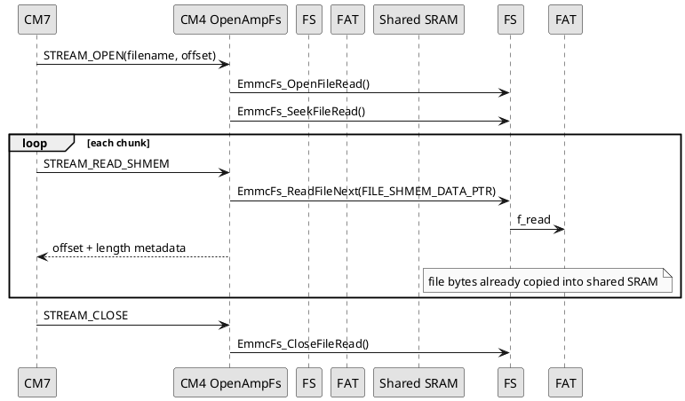
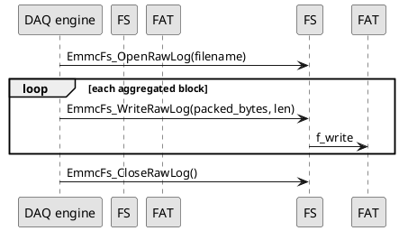

# CM4 Library: emmc_fs

## Scope

`emmc_fs` is the CM4-side filesystem wrapper around FatFs. It is the only documented high-level path used by the current firmware to mount, enumerate, read, delete, and write files on the eMMC volume.

CM4 owns this subsystem. CM7 accesses it indirectly through OpenAMP.

## Source files

| File | Role |
|---|---|
| `CM4/Library/emmc_fs/emmc_fs.h` | public API and status codes |
| `CM4/Library/emmc_fs/emmc_fs.c` | implementation |
| `CM4/Core/Src/mmc_diskio.c` | FatFs disk I/O glue to SDMMC1/MMC |
| `CM4/FATFS/App/fatfs.c` | generated FatFs integration |
| `CM4/FATFS/Target/user_diskio.c` | target disk I/O wrapper |

## High-level responsibilities

`emmc_fs` provides:

- filesystem driver link and mount/format
- file counting and listing
- file size queries
- chunked read helpers
- persistent open/read/close helpers for streaming
- delete operations
- raw DAQ log open/write/close helpers

## Status model

`EmmcFsStatus_t` defines the public error contract.

| Symbol | Value | Meaning |
|---|---:|---|
| `EMMC_FS_OK` | `0` | success |
| `EMMC_FS_ERR_PARAM` | `-1` | invalid input pointer/argument |
| `EMMC_FS_ERR_LINK` | `-2` | FatFs driver link failed |
| `EMMC_FS_ERR_MOUNT` | `-3` | mount failed |
| `EMMC_FS_ERR_NO_FS` | `-4` | no filesystem present |
| `EMMC_FS_ERR_MKFS` | `-5` | format failed |
| `EMMC_FS_ERR_OPEN_DIR` | `-6` | directory open failed |
| `EMMC_FS_ERR_READ_DIR` | `-7` | directory enumeration or related read failed |
| `EMMC_FS_ERR_OPEN_FILE` | `-8` | file open failed |
| `EMMC_FS_ERR_READ_FILE` | `-9` | file read/write/seek/close failed |
| `EMMC_FS_ERR_BUFFER_SMALL` | `-10` | caller buffer too small |

## Public API reference

### `EmmcFs_Init()`

Links the FatFs driver for the CM4 side.

Arguments:
- none

Returns:
- `EMMC_FS_OK` on success
- `EMMC_FS_ERR_LINK` on failure

### `EmmcFs_MountOrFormat()`

Mounts the eMMC filesystem. If a filesystem is missing, it can format and retry.

Arguments:
- none

Returns:
- `EMMC_FS_OK`, `EMMC_FS_ERR_LINK`, `EMMC_FS_ERR_MOUNT`, or `EMMC_FS_ERR_MKFS`

### `EmmcFs_CountAllFiles(uint32_t *file_count)`

Counts root-level files.

Arguments:
- `file_count`: output file count pointer

### `EmmcFs_CountDatFiles(EmmcFsDatSummary_t *summary)`

Counts all files and `.dat` files.

Arguments:
- `summary`: output struct receiving `total_file_count` and `dat_file_count`

### `EmmcFs_ListFiles(char *buffer, uint32_t buffer_size, uint32_t *bytes_used)`

Serializes a directory listing into a caller-provided text buffer.

Arguments:
- `buffer`: destination buffer
- `buffer_size`: max capacity in bytes
- `bytes_used`: output count of valid serialized bytes

Used by command `4` through OpenAMP and CM7 TCP chunking.

### `EmmcFs_DeleteLogFiles(uint32_t *deleted_count)`

Deletes files matching the current log cleanup policy (currently `.bin` / `.dat` maintenance path).

Arguments:
- `deleted_count`: number of deleted files

### `EmmcFs_DeleteFileIfExists(const char *filename, uint32_t *deleted_count)`

Deletes one file if present.

Arguments:
- `filename`: target file name/path
- `deleted_count`: `0` for no-op, `1` for deleted

### `EmmcFs_ReadFileChunk(...)`

```c
EmmcFsStatus_t EmmcFs_ReadFileChunk(const char *filename,
                                    uint32_t offset,
                                    uint8_t *buffer,
                                    uint16_t buffer_size,
                                    uint16_t *bytes_read,
                                    uint32_t *total_size);
```

Opens a file, seeks to `offset`, reads a bounded chunk, and closes it again.

Arguments:
- `filename`: file to read
- `offset`: byte offset inside file
- `buffer`: destination buffer
- `buffer_size`: maximum bytes to read
- `bytes_read`: actual bytes returned
- `total_size`: full file size

Useful for debug and low-throughput chunk access.

### `EmmcFs_OpenFileRead(...)`

Opens a persistent file handle for sequential reads.

Arguments:
- `filename`: target file
- `handle`: output persistent read handle
- `total_size`: output file size

### `EmmcFs_ReadFileNext(...)`

Reads the next sequential chunk from an open read handle.

Arguments:
- `handle`: previously opened read handle
- `buffer`: destination buffer
- `buffer_size`: max read length
- `bytes_read`: actual bytes returned

### `EmmcFs_SeekFileRead(...)`

Seeks an open read handle.

Arguments:
- `handle`: persistent read handle
- `offset`: target file offset

### `EmmcFs_CloseFileRead(...)`

Closes a persistent read handle.

### `EmmcFs_OpenFileWrite(...)`

Opens a generic file write handle.

Arguments:
- `filename`: target file
- `handle`: output write handle

### `EmmcFs_WriteFileNext(...)`

Writes bytes through an open generic write handle.

Arguments:
- `handle`: open write handle
- `buffer`: source bytes
- `buffer_size`: number of bytes to write
- `bytes_written`: actual bytes written

### `EmmcFs_CloseFileWrite(...)`

Closes a generic write handle.

### `EmmcFs_OpenRawLog(const char *filename)`

Opens the active DAQ raw log file.

Arguments:
- `filename`: DAQ log filename

Used by `DAQ_StartLogging()`.

### `EmmcFs_WriteRawLog(...)`

```c
EmmcFsStatus_t EmmcFs_WriteRawLog(const uint8_t *buffer,
                                  uint32_t buffer_size,
                                  uint32_t *bytes_written);
```

Writes raw packed DAQ bytes into the active log file.

Arguments:
- `buffer`: source bytes
- `buffer_size`: number of bytes to write
- `bytes_written`: actual committed count

This function does **not** know DAQ semantics. It just writes the bytes produced by `DAQ_PackBlockSelectedChannels()`.

### `EmmcFs_CloseRawLog(void)`

Closes the active DAQ raw log file.

### `uint8_t EmmcFs_IsRawLogOpen(void)`

Returns whether the raw log handle is currently open.

## Streaming support pattern

High-throughput file streaming uses the persistent read-handle API:



## Raw DAQ logging support pattern

DAQ logging uses the raw log helper family:



## Important design notes

### 1. CM4 is the storage owner

This library assumes CM4 is the active owner of eMMC/FatFs in the current architecture.

### 2. DAQ file format is determined upstream

The DAQ `.bin` format is created by the DAQ engine, not by `emmc_fs`. `emmc_fs` writes whatever raw byte payload it is given.

### 3. Host parsers must mirror DAQ packing rules

If the DAQ engine changes channel selection or packing rules, host `.bin` decoders must be updated as well.
