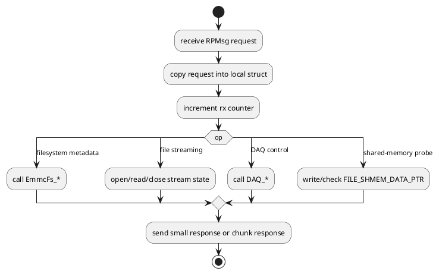

# CM4 Library: OpenAMP Remote Service

## Scope

This document describes the CM4-side OpenAMP service implemented in:

- `CM4/Core/Src/openamp_fs.c`
- `CM4/Core/Inc/openamp_fs.h`

This is not a general-purpose message bus abstraction. In the current firmware it is the concrete RPC surface that CM7 uses to reach CM4-owned DAQ and filesystem functionality.

## High-level role

CM4 exposes one RPMsg endpoint named `openamp_pingpong_demo`. Requests arrive from CM7, are decoded inside `OpenAmpPing_RxCallback()`, and are dispatched to:

- `EmmcFs_*` functions for filesystem work
- `DAQ_*` functions for acquisition control and status
- shared-memory helpers for high-throughput chunk handoff

## Why this layer exists

CM7 is the Ethernet-facing core, but CM4 owns:

- eMMC access
- DAQ acquisition
- DAQ binary packing

So CM7 cannot service many host commands locally. OpenAMP provides the control-plane bridge.

## Initialization API

### `int32_t OpenAmpFs_RemoteInit(void)`

Initializes the CM4 OpenAMP remote side:

- mailbox/HSEM transport init
- OpenAMP remote stack init
- creation of the RPMsg endpoint

Returns:
- `0` on success
- nonzero OpenAMP/HAL-derived status on failure

### `void OpenAmpFs_RemotePoll(void)`

Runs `OPENAMP_check_for_message()` once. This must be called regularly from the CM4 superloop.

### `int32_t OpenAmpFs_GetRemoteInitStatus(void)`

Returns the last stored OpenAMP remote init status.

### `uint32_t OpenAmpFs_GetRemoteRxCount(void)`

Returns the count of successfully received RPMsg requests.

## Request/response model

### Request shape

CM4 expects `OpenAmpPingRequest_t`:

```c
typedef struct
{
  uint32_t op;
  uint32_t value;
  uint32_t length;
  uint32_t arg0;
  uint32_t arg1;
  uint32_t arg2;
  uint32_t arg3;
  char filename[OPENAMP_FILENAME_LEN];
} OpenAmpPingRequest_t;
```

### Response shapes

Two response forms exist:

1. `OpenAmpSmallResponse_t`
   - used for most command/status replies
2. `OpenAmpChunkResponse_t`
   - used when RPMsg needs to carry a data chunk directly

High-throughput file and DAQ streaming avoid large RPMsg payloads by placing bytes in shared SRAM and returning only metadata.

For the default small response, CM4 preloads diagnostic fields before command-specific dispatch:

| Field | Default diagnostic value |
|---|---|
| `arg0` | ADC device ID from `CM4_GetAdcDeviceId()` |
| `arg1` | eMMC mount stage |
| `arg2` | first `f_mount()` FatFs `FRESULT` |
| `arg3` | `f_mkfs()` FatFs `FRESULT` |
| `arg4` | post-format `f_mount()` FatFs `FRESULT` |

Some operations overwrite these fields with operation-specific results. Command `99` preserves and forwards them as the host-visible eMMC mount diagnostics.

## Current operation IDs

The CM4 remote currently implements the following logical services:

These are **OpenAMP internal operation IDs**, not necessarily the same numbers as host TCP commands. For example, host command `97` gets offset calibration values, while OpenAMP operation `97` deletes one file.

| Operation ID | Purpose |
|---:|---|
| `99` | ping / heartbeat |
| `2` | count `.dat` files |
| `3` | count all files |
| `4` | list files into shared memory |
| `5` | get file size |
| `96` | delete `.bin` / `.dat` log files |
| `97` | delete one file |
| `7` | read one file chunk via RPMsg payload |
| `80` | open persistent file stream |
| `81` | read next file stream chunk |
| `82` | close persistent file stream |
| `83` | read next file stream chunk into shared memory |
| `84` | shared-memory probe |
| `85` | get ADC offset calibration values |
| `86` | run ADC offset calibration and persist values |
| `90` | DAQ status |
| `91` | start DAQ log |
| `92` | start DAQ stream |
| `93` | read next DAQ stream block into shared memory |
| `94` | stop DAQ |
| `95` | stop and close DAQ |

## Dispatch pattern

All operations are dispatched from `OpenAmpPing_RxCallback()`.



## Shared-memory usage

Two operations are especially important for throughput:

### File stream shared-memory read

Operation:
- `OPENAMP_OP_STREAM_READ_SHMEM` (`83`)

Behavior:
- CM4 reads file bytes from eMMC into `FILE_SHMEM_DATA_PTR`
- returns metadata only: status, offset, total size, chunk length

### DAQ stream shared-memory read

Operation:
- `OPENAMP_OP_DAQ_READ_SHMEM` (`93`)

Behavior:
- CM4 copies queued `DaqSampleFrame_t` blocks into `FILE_SHMEM_DATA_PTR`
- returns bytes read and samples read

This is what lets CM7 stream large payloads without moving them through RPMsg bodies.

## Important implementation notes

### Filesystem ownership

This layer assumes CM4 owns filesystem access. OpenAMP is the mechanism used to enforce that ownership boundary.

### DAQ mode split

This layer exposes both:

- DAQ log mode (`91`) -> packed selected-channel file layout
- DAQ stream mode (`92`/`93`) -> full `DaqSampleFrame_t` layout

Those are not interchangeable.

### Diagnostics returned to CM7

CM4 replies often include:

- CM4 eMMC init status
- CM4 mount status
- eMMC mount lifecycle stage
- first-mount, mkfs, and post-mount FatFs `FRESULT` values
- ADC device ID

That data is surfaced by CM7 in TCP command `99`.
