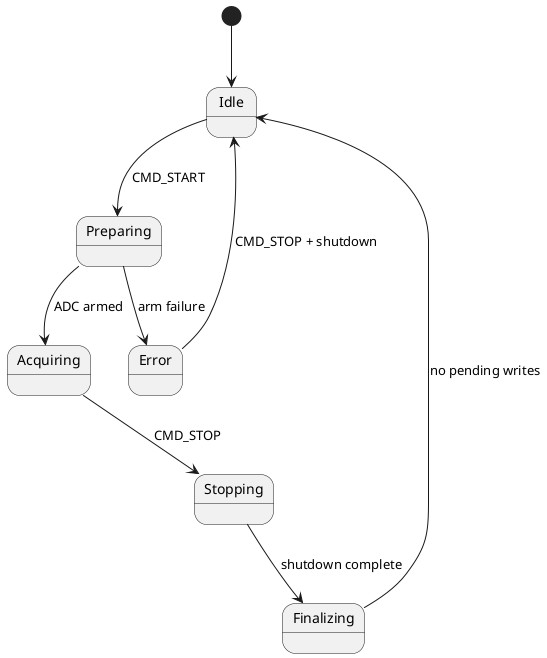
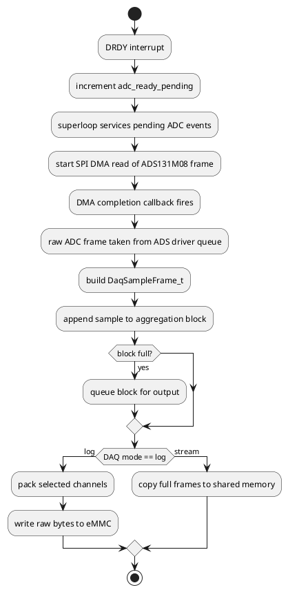

# CM4 Firmware

## Role

CM4 is the deterministic acquisition and storage core.

It runs without an RTOS and executes a cooperative superloop. It owns the peripherals that are most timing-sensitive or storage-sensitive:

- ADS131M08 acquisition path
- SPI4 DMA servicing for ADC reads
- SDMMC1 / eMMC access
- FatFs-backed file operations
- OpenAMP remote command handling for file and DAQ services

The key design rule is simple: **CM4 owns the data plane**.

## Runtime responsibilities

CM4 is responsible for:

- booting after CM7 releases it through HSEM
- initializing the ADC-facing SPI and the eMMC interface
- mounting the filesystem
- creating the OpenAMP RPMsg service used by CM7
- running the DAQ state machine
- packaging and writing raw samples into eMMC log files
- exposing file operations and DAQ operations to CM7

## Main execution model

CM4 main loop in `CM4/Core/Src/main.c` is effectively:

```c
while (1)
{
    DAQ_StateMachine_Run();
    OpenAmpFs_RemotePoll();
}
```

That is the whole model:

- DAQ work is progressed cooperatively
- OpenAMP messages are polled cooperatively
- interrupt handlers only signal events and complete DMA-related handoffs

## Core startup

### File of interest
- `CM4/Core/Src/main.c`

### Sequence

1. wait for CM7 boot synchronization using HSEM
2. initialize HAL and CM4-owned peripherals
3. probe the ADC device ID using the master clock
4. initialize DAQ context and DAQ engine
5. initialize and mount eMMC filesystem through `EmmcFs_*`
6. initialize OpenAMP remote endpoint through `OpenAmpFs_RemoteInit()`
7. enter the superloop

## Interrupts and callback ownership

CM4 uses interrupts as signal sources, not as heavy processing contexts.

### Important callbacks in `main.c`

| Callback | Purpose |
|---|---|
| `HAL_GPIO_EXTI_Callback()` | detects ADS DRDY edge and signals DAQ |
| `HAL_SPI_TxRxCpltCallback()` | completes ADC DMA sample transfer and signals DAQ |
| `HAL_SPI_ErrorCallback()` | reports ADC DMA error to DAQ |

## DAQ state machine

### Files of interest
- `CM4/Library/ads131m08/statemachine.c`
- `CM4/Library/ads131m08/statemachine.h`
- `CM4/Library/ads131m08/daq_engine.c`
- `CM4/Library/ads131m08/daq_engine.h`

### States

| State | Meaning |
|---|---|
| `DAQ_STATE_IDLE` | no active run |
| `DAQ_STATE_PREPARING` | hardware/config bring-up before acquisition |
| `DAQ_STATE_ACQUIRING` | normal sampling, buffering, and output servicing |
| `DAQ_STATE_STOPPING` | stop requested, shutdown in progress |
| `DAQ_STATE_FINALIZING` | flush pending blocks before returning idle |
| `DAQ_STATE_ERROR` | latched error state until stop/reset |

### PlantUML state view



### How acquisition progresses

During `DAQ_STATE_ACQUIRING`, CM4 repeatedly does three things:

1. `DAQ_ServiceAdcPending()`
2. `DAQ_ServiceCapturedSamples()`
3. `DAQ_ServicePendingWrites()`

This is the key acquisition pipeline.

## DAQ data path



## DAQ modes

CM4 supports two distinct output modes through `DaqMode_t`:

| Mode | Purpose |
|---|---|
| `DAQ_MODE_LOG_TO_EMMC` | write packed raw channel data into an eMMC log file |
| `DAQ_MODE_STREAM_TO_SHMEM` | expose full DAQ frames through shared memory for CM7 TCP streaming |

This distinction is important because the binary layout differs.

### Command 11 log layout

For current board assumptions:

- channel mask currently constrained to `0x3F`
- channels `0..5` are packed
- each channel is written as signed 32-bit little-endian
- no response field or CRC field is written
- total = **24 bytes/sample**

### Command 13 stream layout

Stream mode uses full `DaqSampleFrame_t` objects:

- `response` (`uint16`)
- `crc` (`uint16`)
- `channel[8]` (`int32[8]`)
- total = **36 bytes/frame**

## OpenAMP service role on CM4

### Files of interest
- `CM4/Core/Src/openamp_fs.c`
- `CM4/Core/Inc/openamp_fs.h`

CM4 implements the RPMsg service endpoint named `openamp_pingpong_demo`. This service handles file and DAQ requests from CM7.

### Main service categories

| Category | Operations |
|---|---|
| heartbeat / diagnostics | ping, init status, mount status, ADC ID, shared-memory probe |
| filesystem metadata | count `.dat`, count all files, list files, file size |
| filesystem data access | read chunk, open stream, read stream, close stream |
| maintenance | delete logs, delete specific file |
| DAQ control | get status, start log, start stream, stop, stop+close |

The operation IDs are defined locally in `CM4/Core/Src/openamp_fs.c`.

## Filesystem ownership

CM4 owns eMMC and all FatFs access in the current architecture. CM7 does not mount or write the volume directly; it proxies through CM4 using OpenAMP.

That ownership model reduces concurrency problems and keeps storage timing under CM4 control.

## Key source files

| File | Purpose |
|---|---|
| `CM4/Core/Src/main.c` | boot, peripheral init, superloop, callbacks |
| `CM4/Core/Src/openamp_fs.c` | RPMsg/OpenAMP service implementation |
| `CM4/Library/ads131m08/ads131m08.c` | low-level ADC driver |
| `CM4/Library/ads131m08/daq_engine.c` | DAQ capture, aggregation, packing, write/stream handoff |
| `CM4/Library/ads131m08/statemachine.c` | cooperative DAQ state machine |
| `CM4/Library/emmc_fs/emmc_fs.c` | FatFs wrapper and raw log file writer |
| `CM4/Core/Src/mmc_diskio.c` | low-level disk I/O glue for FatFs |

## Library documents

- [CM4 Library Index](Library/README.md)
- [ads131m08 / DAQ engine](Library/ads131m08.md)
- [eMMC filesystem wrapper](Library/emmc_fs.md)
- [OpenAMP remote service](Library/openamp_remote.md)
