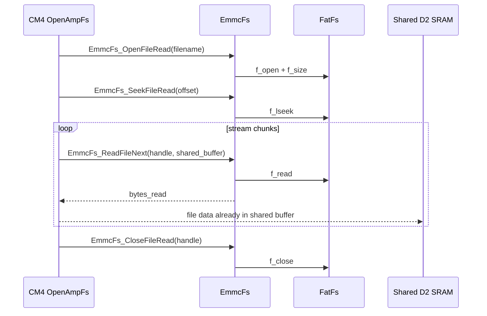
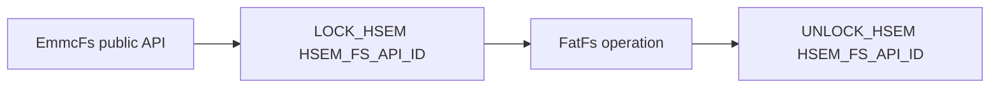

# CM4 eMMC Filesystem

`emmc_fs` is the CM4-side filesystem wrapper around FatFs and the low-level eMMC/MMC disk driver. CM4 owns eMMC access; CM7 must request file operations through OpenAMP instead of calling FatFs or the MMC driver directly.

## Role in the System


`EmmcFs` is intentionally narrow:

- It links and mounts the FatFs driver.
- It creates the deterministic test file used by streaming tests.
- It counts files in the root directory.
- It opens, seeks, reads, and closes files for OpenAMP file operations.
- It keeps filesystem access on CM4, where the eMMC peripheral is initialized.

## Source Files

| File | Purpose |
|---|---|
| `CM4/Library/emmc_fs/emmc_fs.h` | Public API, status codes, read handle type. |
| `CM4/Library/emmc_fs/emmc_fs.c` | FatFs wrapper implementation. |
| `Common/Inc/hsem_ids.h` | HSEM ID used by the filesystem API lock. |
| `Common/Inc/hsem_lock.h` | HSEM lock/unlock helpers. |
| `Common/Src/mmc_diskio.c` | Low-level FatFs disk I/O driver for eMMC/MMC. |

## Status Codes

| Status | Value | Meaning |
|---|---:|---|
| `EMMC_FS_OK` | `0` | Operation succeeded. |
| `EMMC_FS_ERR_PARAM` | `-1` | Invalid pointer, invalid filename, invalid offset, or zero buffer length. |
| `EMMC_FS_ERR_LINK` | `-2` | `FATFS_LinkDriver()` failed. |
| `EMMC_FS_ERR_MOUNT` | `-3` | Mount failed for a reason other than a missing filesystem. |
| `EMMC_FS_ERR_NO_FS` | `-4` | Reserved for missing-filesystem style failures. |
| `EMMC_FS_ERR_MKFS` | `-5` | Format or post-format mount failed. |
| `EMMC_FS_ERR_OPEN_DIR` | `-6` | Directory open failed. |
| `EMMC_FS_ERR_READ_DIR` | `-7` | Directory read or config write failed. |
| `EMMC_FS_ERR_OPEN_FILE` | `-8` | File open failed. |
| `EMMC_FS_ERR_READ_FILE` | `-9` | File seek/read/write/sync/close failed. |

## Initialization and Mount

### `EmmcFs_Init`

```c
EmmcFsStatus_t EmmcFs_Init(void);
```

Links the FatFs MMC driver using `FATFS_LinkDriver(&MMC_Driver, s_emmc_path)`.

Return values:

- `EMMC_FS_OK`: driver is linked.
- `EMMC_FS_ERR_LINK`: FatFs driver link failed.

### `EmmcFs_MountOrFormat`

```c
EmmcFsStatus_t EmmcFs_MountOrFormat(void);
```

Mounts the filesystem immediately. If FatFs reports `FR_NO_FILESYSTEM`, it formats with `f_mkfs()` and mounts again.

Return values:

- `EMMC_FS_OK`: mounted successfully.
- `EMMC_FS_ERR_LINK`: driver link failed.
- `EMMC_FS_ERR_MOUNT`: mount failed for an existing filesystem or disk error.
- `EMMC_FS_ERR_MKFS`: format or post-format mount failed.

Expected CM4 boot usage:

```c
g_cm4_emmc_init_status = EmmcFs_Init();
g_cm4_emmc_mount_status = EmmcFs_MountOrFormat();
```

The current working system initializes OpenAMP and eMMC on CM4, stores the eMMC init/mount result in variables, and returns those values in command `99`.

## File Counting

### `EmmcFs_CountDatFiles`

```c
EmmcFsStatus_t EmmcFs_CountDatFiles(EmmcFsDatSummary_t *summary);
```

Counts files in the root directory and separately counts files ending in `.dat`, case-insensitive.

Arguments:

| Argument | Direction | Meaning |
|---|---|---|
| `summary` | out | Receives `total_file_count` and `dat_file_count`. |

OpenAMP usage:

- CM7 command `2` calls `OpenAmpFs_CountDatFiles()`.
- CM4 handles `OPENAMP_OP_COUNT_DAT`.
- CM4 calls `EmmcFs_CountDatFiles()`.
- CM7 returns `dat_count` over TCP.

### `EmmcFs_CountAllFiles`

```c
EmmcFsStatus_t EmmcFs_CountAllFiles(uint32_t *file_count);
```

Counts all non-directory files in the eMMC root directory.

Arguments:

| Argument | Direction | Meaning |
|---|---|---|
| `file_count` | out | Receives total root-level file count. |

OpenAMP usage:

- CM7 command `3` calls `OpenAmpFs_CountAllFiles()`.
- CM4 handles `OPENAMP_OP_COUNT_ALL`.
- CM4 calls `EmmcFs_CountAllFiles()`.
- CM7 returns `total_count` over TCP.

## Test File Creation

### `EmmcFs_CreatePatternFile`

```c
EmmcFsStatus_t EmmcFs_CreatePatternFile(const char *filename,
                                        uint32_t file_size,
                                        uint32_t *fail_offset,
                                        uint8_t *fail_stage);
```

Creates or rewrites a deterministic test file. The byte pattern is:

```c
byte = (((offset + index) * 37U) + 11U) & 0xFFU;
```

Arguments:

| Argument | Direction | Meaning |
|---|---|---|
| `filename` | in | File name or path. Relative names become `0:/filename`. |
| `file_size` | in | Number of bytes to write. |
| `fail_offset` | out, optional | Offset where write/sync failure happened. |
| `fail_stage` | out, optional | Stage from `EmmcFsCreateStage_t`. |

This pattern is used by the Python receiver to validate streamed data from command `8`.

## Single-Chunk Reads

### `EmmcFs_ReadFileChunk`

```c
EmmcFsStatus_t EmmcFs_ReadFileChunk(const char *filename,
                                    uint32_t offset,
                                    uint8_t *buffer,
                                    uint16_t buffer_size,
                                    uint16_t *bytes_read,
                                    uint32_t *total_size);
```

Opens a file, gets its size, seeks to `offset`, reads up to `buffer_size`, and closes the file.

Arguments:

| Argument | Direction | Meaning |
|---|---|---|
| `filename` | in | File name or path. |
| `offset` | in | Byte offset to read from. |
| `buffer` | out | Destination buffer. |
| `buffer_size` | in | Maximum bytes to read. |
| `bytes_read` | out | Actual number of bytes read. |
| `total_size` | out | Full file size in bytes. |

OpenAMP usage:

- CM7 command `7` calls `OpenAmpFs_ReadFileChunk()`.
- CM4 handles `OPENAMP_OP_READ_CHUNK`.
- CM4 calls `EmmcFs_ReadFileChunk()`.
- Data returns inside the RPMsg response payload.

This path is useful for debug and offset validation. It is not the high-throughput path because the data is copied through RPMsg.

### `EmmcFs_ReadConfigMainChunk`

```c
EmmcFsStatus_t EmmcFs_ReadConfigMainChunk(uint32_t offset,
                                          uint8_t *buffer,
                                          uint16_t buffer_size,
                                          uint16_t *bytes_read,
                                          uint32_t *total_size);
```

Convenience wrapper for reading `0:/config_main.conf` through `EmmcFs_ReadFileChunk()`.

## Persistent File Streaming

The command `8` high-throughput path uses persistent open/read-next/close operations. This avoids repeated open/seek/close for every chunk.



### `EmmcFs_OpenFileRead`

```c
EmmcFsStatus_t EmmcFs_OpenFileRead(const char *filename,
                                   EmmcFsReadHandle_t *handle,
                                   uint32_t *total_size);
```

Opens a file for sequential reads and initializes `EmmcFsReadHandle_t`.

Arguments:

| Argument | Direction | Meaning |
|---|---|---|
| `filename` | in | File name or path. |
| `handle` | out | Persistent file handle. |
| `total_size` | out | Full file size in bytes. |

### `EmmcFs_SeekFileRead`

```c
EmmcFsStatus_t EmmcFs_SeekFileRead(EmmcFsReadHandle_t *handle,
                                   uint32_t offset);
```

Moves an open file handle to a byte offset. The offset must be less than or equal to `handle->total_size`.

### `EmmcFs_ReadFileNext`

```c
EmmcFsStatus_t EmmcFs_ReadFileNext(EmmcFsReadHandle_t *handle,
                                   uint8_t *buffer,
                                   uint16_t buffer_size,
                                   uint16_t *bytes_read);
```

Reads from the current file position. For command `8`, `buffer` is the shared SRAM data buffer from `FILE_SHMEM_DATA_PTR`.

### `EmmcFs_CloseFileRead`

```c
EmmcFsStatus_t EmmcFs_CloseFileRead(EmmcFsReadHandle_t *handle);
```

Closes an open persistent read handle. Closing an already-closed handle returns `EMMC_FS_OK`.

## Path Handling

`EmmcFs_BuildPath()` normalizes user-provided paths:

| Input | Result |
|---|---|
| `test.dat` | `0:/test.dat` |
| `/test.dat` | `0:/test.dat` |
| `0:/test.dat` | `0:/test.dat` |

The configured main file path is fixed:

```text
0:/config_main.conf
```

## Locking Model

Every public filesystem operation locks `HSEM_FS_API_ID` before touching FatFs state and unlocks after the FatFs operation is complete.



This protects the FatFs wrapper from concurrent calls. The current architecture still keeps all eMMC access on CM4; the HSEM lock is a defensive guard around filesystem state, not a license for CM7 to access eMMC directly.

## Integration with OpenAMP File Streaming

Command `8` uses eMMC like this:

1. CM7 receives the TCP stream request.
2. CM7 sends `OPENAMP_OP_STREAM_OPEN` to CM4.
3. CM4 calls `EmmcFs_OpenFileRead()` and optionally `EmmcFs_SeekFileRead()`.
4. CM7 sends `OPENAMP_OP_STREAM_READ_SHMEM` for each chunk.
5. CM4 calls `EmmcFs_ReadFileNext()` with the shared SRAM buffer.
6. CM4 replies with status, offset, and byte count only.
7. CM7 sends the shared SRAM bytes over TCP without copying them into an RPMsg payload.
8. CM7 sends `OPENAMP_OP_STREAM_CLOSE` when streaming finishes or fails.
9. CM4 calls `EmmcFs_CloseFileRead()`.

The eMMC data path for command `8` is:

```text
eMMC -> MMC disk I/O -> FatFs -> EmmcFs_ReadFileNext() -> shared D2 SRAM -> CM7 TCP send
```

## Current Assumptions

- CM4 initializes SDMMC/eMMC and FatFs before serving file operations.
- CM7 does not call `EmmcFs` directly.
- The shared stream buffer is reserved from both linkers.
- CM7 marks the shared SRAM MPU region as non-cacheable.
- The working stream chunk size is `16 KiB`.

## Debug Notes

Use command `99` before debugging file commands. The key fields are:

| Field | Healthy Value | Meaning |
|---|---:|---|
| `remote_init_status` | `0` | CM4 OpenAMP init succeeded. |
| `remote_mount_status` | `0` | CM4 eMMC mount succeeded. |
| `shmem_probe_status` | `0` | CM4 wrote shared SRAM and CM7 read it correctly. |
| `shmem_probe_bad_index` | `0xFFFFFFFF` | No mismatched shared-memory byte. |

If file counts work but command `8` fails, focus on shared SRAM setup. If command `2`, `3`, `5`, and `7` fail, focus on CM4 eMMC mount, FatFs, or OpenAMP request/response handling.
