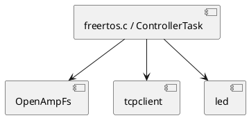

# CM7 Libraries

This section documents the CM7-side helper libraries that support the control and transport plane.

## Library overview

| Library | Source path | Purpose |
|---|---|---|
| `tcpclient` | `CM7/Library/eth` | TCP transport to the host Python server, including fixed replies and streamed transfers |
| `led` | `CM7/Library/led` | RGB LED helper used for basic board indication |
| `openamp_fs` | `CM7/Core/Src/openamp_fs.c` | CM7-side OpenAMP master wrapper used by ControllerTask to call CM4 services and collect command `99` diagnostics |

## Relationship to CM7 core code

## Reading order

1. Read [TCP client library](tcpclient.md) first. It explains the host transport path.
2. Read [LED helper library](led.md) if you need to understand board-visible status support.
3. Read [OpenAMP master service](openamp_master.md) to understand the CM7-to-CM4 RPC layer.
