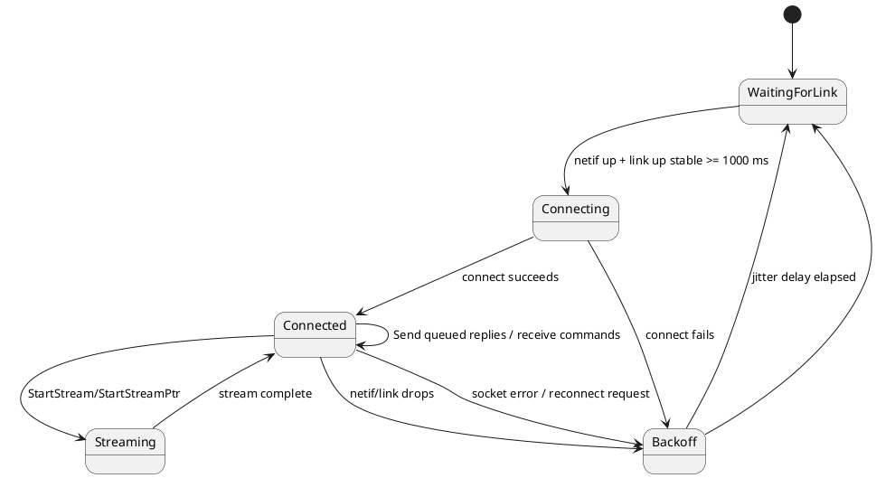

# CM7 Library: tcpclient

## Scope

`tcpclient` is the CM7 Ethernet transport library. It owns the TCP socket that connects the board to the host computer and moves command replies, file payloads, and live DAQ payloads over that socket.

The board is intentionally a **TCP client**. The Python tooling on the laptop/Raspberry Pi listens as the TCP server on port `10`, and one or more boards connect outward to that host.

## Source Files

| File | Role |
|---|---|
| `CM7/Library/eth/tcpclient.h` | Public API, callbacks, timeout defaults, stream callback types |
| `CM7/Library/eth/tcpclient.c` | Socket task, reconnect policy, TX queueing, receive dispatch, stream engine |
| `CM7/Core/Src/freertos.c` | Builds the `TcpClientConfig_t`, sends command responses, starts file/DAQ streams |
| `CM7/LWIP/Target/ethernetif.c` | Ethernet PHY/MAC bring-up and link-state maintenance used by `tcpclient` |
| `CM7/LWIP/Target/lwipopts.h` | LwIP resource limits, including TCP PCB count |
| `CM7/Core/Inc/aems_network_config.h` | CubeMX-safe board IP, server IP/port, and UID-derived MAC policy |

## High-Level Responsibilities

`tcpclient` provides:

- TCP client connect/reconnect logic to the configured host IP and port.
- Link-stability gating before opening a socket.
- Rotating local source-port binding to avoid stale TCP 4-tuples after resets.
- Per-board reconnect jitter so multiple boards do not reconnect in lock-step.
- TCP keepalive and app-level idle heartbeat for half-open connection detection.
- Connected-state link monitoring that closes the socket if netif/link drops.
- Fixed response transmission for normal commands.
- Receive callback dispatch to the CM7 command parser.
- Mailbox-based TX queueing for normal command responses.
- Stream-header plus raw-payload transfer for file, test, and DAQ streams.

## Runtime Model

The library contains one process-wide state object, `TcpClientState_t`.

It owns:

- `sock`: active LwIP socket descriptor.
- `connected`: current socket state exposed by `TcpClient_IsConnected()`.
- `reconnect_requested`: async reconnect request flag.
- `cfg`: host IP, port, netif, and RX callback.
- `tx_mbox`: LwIP mailbox for queued fixed responses.
- `tx_mutex`: serializes socket writes.
- `pending_tx_msgs`: queued-message diagnostic/count guard.
- `connect_attempt`: monotonically increasing reconnect-attempt counter.
- `last_connect_status`: last internal connect-stage result (`0` after success, negative on failure).
- `last_socket_error`: last `errno` / `SO_ERROR` value recorded during connect/send handling.
- `local_port`: last bound TCP source port.
- `network_ready_since_ms` / `network_ready_valid`: link-stability gate state.
- `stream`: active stream header, counters, callbacks, and chunk buffer.



## Public Config and Callback Types

### `TcpClientRxHandler_t`

```c
typedef void (*TcpClientRxHandler_t)(const char *data, uint16_t length);
```

Called when command bytes arrive from the host.

Arguments:

- `data`: received bytes.
- `length`: received byte count.

Current firmware points this at `ProcessTcpData()` in `CM7/Core/Src/freertos.c`.

### `TcpClientStreamReadFn`

```c
typedef int32_t (*TcpClientStreamReadFn)(void *context,
                                         uint8_t *buffer,
                                         uint16_t max_len,
                                         uint16_t *out_len);
```

Copy-style stream callback.

Arguments:

- `context`: stream context pointer.
- `buffer`: destination buffer owned by `tcpclient`.
- `max_len`: buffer capacity in bytes.
- `out_len`: returned valid byte count.

Used by command `9` test stream.

### `TcpClientStreamReadPtrFn`

```c
typedef int32_t (*TcpClientStreamReadPtrFn)(void *context,
                                            const uint8_t **out_data,
                                            uint16_t max_len,
                                            uint16_t *out_len);
```

Pointer-style stream callback.

Arguments:

- `context`: stream context pointer.
- `out_data`: returned pointer to bytes to send.
- `max_len`: maximum allowed chunk size for this iteration.
- `out_len`: returned valid byte count.

Used by high-throughput paths where the bytes already live in shared SRAM:

- command `8`: stream file from eMMC through CM4 -> shared SRAM -> CM7 -> TCP.
- command `13`: stream live DAQ frames through CM4 -> shared SRAM -> CM7 -> TCP.

### `TcpClientStreamDoneFn`

```c
typedef void (*TcpClientStreamDoneFn)(void *context);
```

Called when a stream completes or aborts.

### `TcpClientConfig_t`

```c
typedef struct
{
    ip_addr_t ServerIp;
    uint16_t ServerPort;
    struct netif *Netif;
    TcpClientRxHandler_t RxHandler;
} TcpClientConfig_t;
```

Fields:

- `ServerIp`: host server IP address.
- `ServerPort`: host TCP server port. Current default is `10`.
- `Netif`: LwIP network interface.
- `RxHandler`: callback for incoming command bytes.

## Public API Reference

### `void TcpClient_BuildConfig(...)`

Populates a `TcpClientConfig_t`.

Arguments:

- `config`: destination configuration.
- `serverIp`: host server IP.
- `serverPort`: host TCP port.
- `netif`: LwIP network interface.
- `rxHandler`: host-command receive callback.

### `int32_t TcpClient_Init(const TcpClientConfig_t *config)`

Initializes the TCP client task and internal resources.

Arguments:

- `config`: validated configuration.

Returns:

- `0`: success or already initialized.
- `-1`: invalid config or missing netif.
- `-2`: TX mailbox creation failed.
- `-3`: TX mutex or TCP client task creation failed.

### `int32_t TcpClient_SendBuffer(const uint8_t *data, uint16_t length)`

Queues bytes for transmission to the connected host.

Arguments:

- `data`: source bytes.
- `length`: number of bytes to queue.

Used by `ControllerTask()` for:

- fixed command replies,
- command `4` file-list chunks,
- command `99` diagnostics,
- stream ACK/control replies.

### `int32_t TcpClient_StartStream(...)`

Starts a stream using the copy callback interface.

Arguments:

- `header`: stream header bytes.
- `header_len`: stream header length.
- `total_size`: total payload bytes after the header.
- `read_fn`: copy-style callback.
- `done_fn`: completion callback.
- `context`: callback context.

Used by command `9` test stream.

### `int32_t TcpClient_StartStreamPtr(...)`

Starts a stream using the pointer callback interface.

Arguments:

- `header`: stream header bytes.
- `header_len`: stream header length.
- `total_size`: total payload bytes after the header.
- `read_ptr_fn`: pointer-style callback.
- `done_fn`: completion callback.
- `context`: callback context.

Used by:

- command `8` file stream,
- command `13` live DAQ stream.

### `int32_t TcpClient_Send(const char *text)`

Queues a null-terminated string.

### `uint8_t TcpClient_IsConnected(void)`

Returns:

- `1`: socket is connected to the host.
- `0`: socket is disconnected.

### `uint8_t TcpClient_IsStreamActive(void)`

Returns whether a file/test/DAQ stream is currently using the TCP socket.

This is used by `TelemetryTask()` to avoid sending idle heartbeat packets into
the middle of a raw stream payload.

### `uint16_t TcpClient_GetLocalPort(void)`

Returns the last local TCP source port selected by the rotating bind logic.

Command `99` exposes this so host logs can confirm that board resets are not
reusing the same stale TCP 4-tuple.

### `uint16_t TcpClient_GetServerPort(void)`

Returns the configured remote server port.

### `uint32_t TcpClient_GetConnectAttempt(void)`

Returns the number of TCP connect attempts made since boot.

### `int32_t TcpClient_GetLastConnectStatus(void)`

Returns the last internal connect-stage status:

- `0`: last connect completed successfully
- negative value: connect failed at a specific stage inside `TcpClient_ConnectOnce()`

### `int32_t TcpClient_GetLastSocketError(void)`

Returns the last socket-level error recorded from `errno` or `SO_ERROR`.

### `void TcpClient_RequestReconnect(void)`

Requests the socket task to close the current socket and reconnect.

## Transport Constants

Current defaults:

| Constant | Value | Purpose |
|---|---:|---|
| `TCPCLIENT_CONNECT_TIMEOUT_MS` | `1000` | Non-blocking connect completion timeout |
| `TCPCLIENT_RX_BUFFER_LEN` | `128` | Command receive buffer size; matches the fixed host command length |
| `TCPCLIENT_STREAM_CHUNK_LEN` | `16 * 1024` | Max stream payload chunk sent per socket iteration |
| `TCPCLIENT_LINK_WAIT_MS` | `250` | Poll interval while waiting for Ethernet link readiness |
| `TCPCLIENT_LINK_STABLE_MS` | `1000` | Required continuous link-up time before opening a socket |
| `TCPCLIENT_LOCAL_PORT_MIN` | `49152` | First local ephemeral source port used by explicit bind |
| `TCPCLIENT_LOCAL_PORT_RANGE` | `12000` | Local source-port rotation range |
| `TCPCLIENT_LOCAL_PORT_TRIES` | `8` | Number of local source ports tried before connect attempt fails |
| `TCPCLIENT_RECONNECT_MIN_MS` | `700` | Minimum reconnect backoff |
| `TCPCLIENT_RECONNECT_SPAN_MS` | `1000` | Additional randomized reconnect spread |
| `TCPCLIENT_KEEPIDLE_SEC` | `10` | TCP keepalive idle time after connection becomes quiet |
| `TCPCLIENT_KEEPINTVL_SEC` | `3` | TCP keepalive probe interval |
| `TCPCLIENT_KEEPCNT` | `3` | TCP keepalive probe count before the stack aborts |

## Fixed Response Framing

Most commands use a fixed 128-byte response format. The first 15 bytes are common:

| Offset | Size | Meaning |
|---:|---:|---|
| `0` | 1 | command |
| `1` | 4 | server ID, big-endian |
| `5` | 8 | epoch time, big-endian |
| `13` | 1 | status |
| `14` | 1 | TCP connected flag |
| `15+` | command-specific fields, zero-padded to 128 bytes |

Command `99` uses this fixed response to expose board diagnostics. Important fields are:

| Offset | Size | Meaning |
|---:|---:|---|
| `15` | 4 | OpenAMP heartbeat reply value |
| `19` | 4 | CM7-to-CM4 ping status |
| `23` | 4 | OpenAMP service-created flag |
| `27` | 4 | OpenAMP RX count |
| `31` | 4 | CM7 OpenAMP init status |
| `35` | 4 | CM4 OpenAMP init status |
| `39` | 4 | CM4 public eMMC mount status |
| `43` | 4 | shared-memory probe status |
| `47` | 4 | shared-memory probe length |
| `51` | 4 | shared-memory bad index |
| `55` | 4 | last file-stream open status |
| `59` | 4 | last file-stream prefetch status |
| `63` | 4 | last file-stream prefetch length |
| `67` | 4 | remote ADS131M08 device ID |
| `71` | 4 | eMMC mount lifecycle stage |
| `75` | 4 | first `f_mount()` FatFs `FRESULT` |
| `79` | 4 | `f_mkfs()` FatFs `FRESULT` |
| `83` | 4 | post-format `f_mount()` FatFs `FRESULT` |
| `87` | 4 | configured board IPv4 address, big-endian packed |
| `91` | 4 | configured server IPv4 address, big-endian packed |
| `95` | 4 | current/last TCP local source port |
| `99` | 4 | configured TCP server port |
| `103` | 4 | TCP connect-attempt count since boot |
| `107` | 4 | last TCP connect-stage status, signed |
| `111` | 4 | last socket error / `SO_ERROR`, signed |
| `115` | 6 | UID-derived board MAC address |

`UnitTests/tcptest.py` and `BoardInterfaceLibrary.ResponseParser` decode these fields and add human-readable strings such as `board_ip_address`, `server_ip_address`, and `board_mac_address`.

## Stream Framing

Commands `8`, `9`, and `13` send an 18-byte stream header followed by raw payload bytes.

| Offset | Size | Meaning |
|---:|---:|---|
| `0` | 1 | command |
| `1` | 1 | stream status |
| `2` | 4 | server ID |
| `6` | 8 | epoch time |
| `14` | 4 | total payload bytes following |

Notes:

- File stream uses the actual file byte count.
- Live DAQ stream can use a sentinel-sized stream because the stop condition is command-driven.
- The host library parses the header and then consumes raw bytes based on the stream mode.

## File Stream Path

```plantuml
@startuml
skinparam monochrome true
skinparam shadowing false
participant CTRL as ControllerTask
participant OA as CM7 OpenAmpFs
participant TCP as tcpclient
participant CM4 as CM4
participant SHM as Shared SRAM
participant Host

CTRL -> OA : OpenFileStream(filename, offset)
OA -> CM4 : STREAM_OPEN
CM4 --> OA : file_size/status
CTRL -> TCP : StartStreamPtr(header)
TCP --> Host : 18-byte stream header
loop each chunk
  TCP -> CTRL : read_ptr callback
  CTRL -> OA : ReadFileStreamShared()
  OA -> CM4 : STREAM_READ_SHMEM
  CM4 -> SHM : fill shared chunk
  CM4 --> OA : offset/length
  CTRL --> TCP : pointer to SHM bytes
  TCP --> Host : raw file bytes
end
TCP -> CTRL : done callback
CTRL -> OA : CloseFileStream()
@enduml
```

## Live DAQ Stream Path

```plantuml
@startuml
skinparam monochrome true
skinparam shadowing false
participant CTRL as ControllerTask
participant OA as CM7 OpenAmpFs
participant TCP as tcpclient
participant CM4 as CM4
participant SHM as Shared SRAM
participant Host

CTRL -> OA : DaqStartStream(config)
OA -> CM4 : DAQ_START_STREAM
CM4 --> OA : start status
CTRL -> TCP : StartStreamPtr(header, total_size)
TCP --> Host : 18-byte stream header
loop each DAQ chunk
  TCP -> CTRL : read_ptr callback
  CTRL -> OA : DaqReadStreamShared()
  OA -> CM4 : DAQ_READ_SHMEM
  CM4 -> SHM : copy DAQ frames
  CM4 --> OA : bytes_read / samples_read
  CTRL --> TCP : pointer to SHM bytes
  TCP --> Host : raw DAQ bytes
end
TCP -> CTRL : done callback
CTRL -> OA : DaqStop()
@enduml
```

## Multi-Board Behavior

Multiple boards can connect to the same Python host server at the same TCP port. Each board is identified on the host by its IP address.

The firmware-side requirements are:

- Every board must have a unique static IP address.
- Every board must have a unique MAC address.
- The TCP client must not reuse the same local source port after every reset.
- Reconnect attempts should not happen at the exact same cadence on every board.

The current implementation addresses everything except per-board static IP assignment:

- `AEMS_Network_GetMac()` derives a stable MAC from the STM32 UID.
- `TcpClient_BindRotatingLocalPort()` explicitly binds each outgoing connection to a source port in the dynamic/private range.
- `TcpClient_ReconnectDelayMs()` adds board-specific jitter using STM32 UID, MAC address, attempt counter, and `sys_now()`.

## Network Identity Configuration

Board identity is centralized in:

```text
CM7/Core/Inc/aems_network_config.h
```

This file is intentionally outside generated LwIP source. It is the safe place
to change network identity before flashing a board.

Current fields:

| Setting | Current default | Notes |
|---|---|---|
| Board IP | `192.168.0.11` | Must be unique per board if using static IP builds |
| Netmask | `255.255.255.0` | Standard local AEMS subnet |
| Gateway | `0.0.0.0` | Not required for same-subnet Pi/host operation |
| Server IP | `192.168.0.20` | Raspberry Pi / host TCP server |
| Server port | `10` | Board connects outward to this port |
| MAC prefix | `02:80:E1` | Locally administered unicast prefix |

The last three MAC bytes are derived from `HAL_GetUIDw0/1/2()` with a small
32-bit mixer. That means the same firmware image can produce a different MAC on
different STM32 parts, avoiding the previous failure mode where boards shared
`00:80:E*:00:00:00`.

CubeMX-safe hooks:

- `CM7/LWIP/App/lwip.c`
  - generated IP bytes are overwritten inside `USER CODE BEGIN IP_ADDRESSES`
  - calls `AEMS_Network_GetBoardIp()`, `AEMS_Network_GetNetmask()`, and `AEMS_Network_GetGateway()`
- `CM7/LWIP/Target/ethernetif.c`
  - generated MAC bytes are overwritten inside `USER CODE BEGIN MACADDRESS`
  - calls `AEMS_Network_GetMac()`
- `CM7/Core/Src/freertos.c`
  - `StartDefaultTask()` builds the TCP server IP from `AEMS_Network_GetServerIp()`
  - server port comes from `AEMS_SERVER_PORT`

Important limitation: the current board IP is still a compile-time static IP.
If the same firmware image is flashed to two boards without changing
`AEMS_BOARD_IP_ADDR3`, those boards will still collide at the IP layer even
though their MAC addresses are unique.

## Error Fixes

### Bug: intermittent TCP connection after power-up or board reset

Observed behavior:

- A board sometimes connected immediately after power-up, and sometimes did not.
- Pressing the board reset button often made the TCP connection work immediately.
- The issue was more visible when the Python TCP server was not already listening at board boot.
- With two boards on the same Ethernet switch, one board could work while the other needed several resets.
- Wireshark showed repeated SYN/SYN-ACK/ACK or stale connection behavior in some runs.

Root causes addressed:

1. **PHY hardware state was not guaranteed clean**
   - The board reset button also resets the LAN8742 through the `ETH_NRST` line.
   - Firmware was relying mainly on LAN8742 software initialization.
   - If the PHY/switch negotiation path came up in a bad state, software init was not always enough.

2. **TCP connect could start too early**
   - `LAN8742_Init()` returning OK does not prove the full Ethernet path is ready.
   - The PHY may be up while switch learning, link transition handling, or lwIP netif state is still settling.
   - Opening a socket immediately after link-up made the first connect attempt race the network.

3. **Source-port reuse after reset**
   - Reusing the same source port recreates the same TCP 4-tuple:
     `board_ip:source_port -> host_ip:10`.
   - If the host or network still has stale TCP state, the new connection can be confused with the previous one.

4. **Synchronized reconnect attempts**
   - Multiple boards retrying every fixed `1000 ms` can repeatedly collide in timing.
   - This is especially poor when the host server starts after the boards are already running.

5. **Insufficient LwIP TCP PCB headroom**
   - A single active TCP PCB is fragile during rapid reconnects.
   - Stale closing/TIME_WAIT-like state can temporarily consume resources.

6. **Half-open connection state after switch/server loss**
   - A TCP socket can appear locally connected after the host, switch, or cable path has disappeared.
   - Without keepalive or an app heartbeat, the board may wait too long before realizing the connection is stale.

7. **Generated network identity was easy to overwrite**
   - CubeMX owns `lwip.c` and `ethernetif.c`.
   - Hard-coded IP/MAC edits in generated sections can be lost during code generation.

### Fix 1: hardware reset the LAN8742 before PHY init

Implemented in `CM7/LWIP/Target/ethernetif.c`.

The CM7 now drives `ETH_NRST` around every PHY init attempt:

```c
HAL_GPIO_WritePin(ETH_NRST_GPIO_Port, ETH_NRST_Pin, GPIO_PIN_RESET);
osDelay(10U);
HAL_GPIO_WritePin(ETH_NRST_GPIO_Port, ETH_NRST_Pin, GPIO_PIN_SET);
osDelay(150U);
```

This makes firmware boot behave like pressing the board reset button from the PHY's perspective.

Key details:

- `ETH_NRST_Pin` is defined in `CM7/Core/Inc/main.h`.
- `MX_GPIO_Init()` configures the pin in `CM7/Core/Src/gpio.c`.
- `EthernetIf_HardResetPhy()` is placed in a USER CODE section so CubeMX regeneration preserves it.
- `EthernetIf_InitPhyWithRetry()` calls the hard reset before each `LAN8742_Init()` attempt.

### Fix 2: retry PHY initialization instead of entering a permanent dead-end

Implemented in `CM7/LWIP/Target/ethernetif.c`.

Previous failure mode:

```c
if (LAN8742_Init(&LAN8742) != LAN8742_STATUS_OK) {
    netif_set_link_down(netif);
    netif_set_down(netif);
    return;
}
```

That path left the interface down with no useful recovery.

Current policy:

- Try LAN8742 initialization multiple times.
- Hardware-reset the PHY before each attempt.
- If init still fails, mark the PHY as uninitialized.
- Let `ethernet_link_thread()` retry later.
- If PHY register reads fail during link polling, stop ETH, mark link down, and retry PHY init.

### Fix 3: wait for stable link before TCP connect

Implemented in `CM7/Library/eth/tcpclient.c`.

`TcpClient_IsNetworkStable()` requires:

- `Netif != NULL`,
- `netif_is_up(Netif)`,
- `netif_is_link_up(Netif)`,
- and those conditions must remain true for `TCPCLIENT_LINK_STABLE_MS` (`1000 ms`).

Only after that gate passes does `TcpClient_ConnectOnce()` create and connect a socket.

This prevents an early TCP connect from racing PHY auto-negotiation, switch port learning, or lwIP link-state transitions.

### Fix 4: rotate the local TCP source port

Implemented in `CM7/Library/eth/tcpclient.c`.

Before every connect, the client binds to a local ephemeral port:

- minimum: `49152`,
- range: `12000`,
- attempts per connect: `8`.

The port is derived from:

- STM32 unique ID,
- board MAC address,
- connect attempt counter,
- `sys_now()`,
- per-try salt.

This avoids repeatedly using the same TCP 4-tuple after board resets.

### Fix 5: reconnect jitter

Implemented in `CM7/Library/eth/tcpclient.c`.

Reconnect delay is now randomized per board/attempt:

- minimum: `700 ms`,
- additional spread: `0..1000 ms`,
- effective range: `700..1700 ms`.

This prevents multiple boards from retrying in lock-step.

### Fix 6: increase LwIP TCP PCB count

Implemented in `CM7/LWIP/Target/lwipopts.h`.

`MEMP_NUM_TCP_PCB` is overridden in a USER CODE section to `8`.

Reason:

- The generated value was too small for robust reconnect behavior.
- More PCB headroom prevents temporary TCP state from starving the client after resets or failed connects.

### Fix 7: derive MAC address from STM32 UID

Implemented in `CM7/Core/Inc/aems_network_config.h` and used from
`CM7/LWIP/Target/ethernetif.c`.

The generated CubeMX MAC bytes are overwritten inside `USER CODE BEGIN
MACADDRESS`. The new MAC:

- uses locally administered unicast prefix `02:80:E1`
- derives the lower three bytes from `HAL_GetUIDw0/1/2()`
- stays stable for a physical MCU across firmware reboots
- differs across boards without needing manual per-board MAC edits

### Fix 8: close connected sockets when link/netif drops

Implemented in `CM7/Library/eth/tcpclient.c`.

The TCP task now calls `TcpClient_IsNetworkStable()` while connected. If the
netif is down or link is down, it closes the current socket and enters the same
jittered reconnect path as any other socket error.

This prevents the board from staying in a locally connected state after cable
pulls, switch resets, or PHY recovery events.

### Fix 9: TCP keepalive and app-level idle heartbeat

Implemented in:

- `CM7/LWIP/Target/lwipopts.h`
- `CM7/Library/eth/tcpclient.c`
- `CM7/Core/Src/freertos.c`

LwIP keepalive is enabled with:

- idle: `10 s`
- interval: `3 s`
- count: `3`

CM7 also sends an unsolicited command `0` heartbeat every `10 s` while the
socket is connected and no raw stream is active. This keeps the Raspberry Pi
daemon's `last_seen` status fresh and forces the socket send path to notice
dead connections sooner.

The heartbeat is intentionally disabled during file/DAQ streams because raw
stream payloads and fixed control packets still share one TCP byte stream.

### Why the final fix worked

The link-stable delay alone did not fully solve the issue. The decisive fix was adding the **hardware PHY reset through `ETH_NRST`** before LAN8742 initialization.

This matched the field observation:

- Pressing the physical board reset button made the connection recover.
- The physical reset likely reset both MCU and LAN8742.
- Firmware now performs that PHY reset explicitly during Ethernet initialization and recovery.

## CubeMX Safety

The Ethernet file is CubeMX-generated, so custom logic must stay inside USER CODE sections.

Current CubeMX-safe pattern:

- `CM7/Core/Inc/aems_network_config.h` owns board IP, server IP/port, and MAC derivation policy.
- `CM7/LWIP/App/lwip.c` applies IP/netmask/gateway overrides inside `USER CODE BEGIN IP_ADDRESSES`.
- `CM7/LWIP/Target/ethernetif.c` applies the UID-derived MAC inside `USER CODE BEGIN MACADDRESS`.
- `EthernetIf_HardResetPhy()` and `EthernetIf_InitPhyWithRetry()` live in `USER CODE BEGIN 3`.
- The generated `LAN8742_Init(&LAN8742)` call is wrapped using a USER CODE macro in `PHY_PRE_CONFIG`.
- The macro is undefined in `PHY_POST_CONFIG`.
- `ethernet_link_thread()` recovery logic lives in USER CODE-compatible areas around the generated link loop.
- `lwipopts.h` TCP PCB and keepalive overrides live in `USER CODE BEGIN 1`.

After CubeMX regeneration, verify:

- `ETH_NRST` is still configured as a GPIO output and default-high.
- `lwip.c` still calls `AEMS_Network_GetBoardIp()` inside `USER CODE BEGIN IP_ADDRESSES`.
- `ethernetif.c` still calls `AEMS_Network_GetMac()` inside `USER CODE BEGIN MACADDRESS`.
- `EthernetIf_HardResetPhy()` still exists.
- `LAN8742_Init(obj)` is still redirected to `EthernetIf_InitPhyWithRetry()` inside `PHY_PRE_CONFIG`.
- `MEMP_NUM_TCP_PCB` is still overridden to `8`.
- `LWIP_TCP_KEEPALIVE` remains enabled.

## Debugging Checklist

If a board does not connect:

1. Confirm the host Python server is listening on the correct interface and port `10`.
2. Check that the board IP and MAC are unique.
   - command `99` reports `board_ip`, `board_mac`, `server_ip`, `tcp_local_port`, `tcp_connect_attempt`, `tcp_last_connect_status`, and `tcp_last_socket_error`.
3. Run Wireshark filter:

   ```text
   (ip.addr == 192.168.0.20 || ip.addr == 192.168.0.10 || ip.addr == 192.168.0.11 || ip.addr == 192.168.0.13) && tcp.port == 10
   ```

4. Confirm the board sends SYN packets from varying source ports across resets.
5. Confirm the host returns SYN-ACK.
6. If SWV is enabled, inspect PHY init, link poll, connect attempt, and connect error logs.
7. If the first boot fails but pressing reset fixes it, inspect `ETH_NRST` timing and PHY reset wiring first.

## Important Implementation Note

The library supports pointer-based streaming because that is how CM7 avoids extra copies when moving data from shared SRAM to the host socket. This is a key performance feature for commands `8` and `13`.

The reconnect fixes should not change stream framing or command parsing. They only control when and how the socket is opened after reset, link transitions, and server availability changes.
