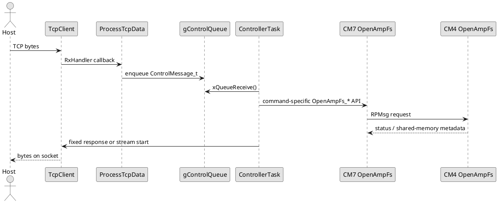

# CM7 Firmware

## Role

CM7 is the supervisory and transport core.

It runs FreeRTOS and LwIP, maintains the TCP connection to the host, accepts host-issued commands, proxies DAQ/filesystem requests into CM4 through OpenAMP, and streams returned data back over Ethernet.

The key design rule is: **CM7 owns the control plane and the host interface**.

## Runtime responsibilities

CM7 is responsible for:

- system clock, MPU, and cache configuration
- FreeRTOS startup
- LwIP initialization
- TCP client connection to the host computer
- command receive and command dispatch
- OpenAMP master-side RPC into CM4
- framing of TCP responses and stream headers
- forwarding DAQ and file payloads from shared memory to the host

## Main components

### Boot and RTOS bring-up
- `CM7/Core/Src/main.c`
- `CM7/Core/Src/freertos.c`

### Inter-core control plane
- `CM7/Core/Src/openamp_fs.c`
- `CM7/Core/Inc/openamp_fs.h`

### Host TCP transport
- `CM7/Library/eth/tcpclient.c`
- `CM7/Library/eth/tcpclient.h`

### Utility / status indication
- `CM7/Library/led/led.c`
- `CM7/Library/led/led.h`

## FreeRTOS task model

### Tasks created today

| Task | Priority | Purpose |
|---|---|---|
| `defaultTask` | high | initializes LwIP and TCP client, then yields |
| `controllerTask` | normal | command execution and response/stream orchestration |
| `telemetryTask` | low | RGB LED status service and idle TCP heartbeat generation |

### Initialization flow

1. `main()` configures clocks, cache, MPU, GPIO, DMA, timer, and LED.
2. `MX_FREERTOS_Init()` creates queues and tasks.
3. `StartDefaultTask()` initializes LwIP and the TCP client.
4. `ControllerTask()` waits on the control queue and serves host commands.

## Command handling model

TCP receive bytes are handed to `ProcessTcpData()`, which converts them into `ControlMessage_t` items and pushes them into `gControlQueue`.

`ControllerTask()` is the main command dispatcher.

### Current command classes

| Command | Role |
|---:|---|
| `0` | heartbeat |
| `2` / `3` | file counts |
| `4` | file list with size text payload |
| `5` | file size query |
| `6` / `7` | delete logs / delete specific file |
| `8` | file stream |
| `9` | test stream |
| `10` / `110` | DAQ status |
| `11` | start DAQ log to eMMC |
| `12` | stop DAQ |
| `13` | start DAQ live stream |
| `97` | get current CM4 ADC offset calibration values |
| `98` | run CM4 ADC offset calibration and persist the new values |
| `99` | OpenAMP heartbeat / diagnostic snapshot, including eMMC mount/format and network/TCP reconnect diagnostics |
| `112` | stop and close DAQ log |

## CM7 to CM4 command path

## Stream handling model

CM7 provides two kinds of host-visible streams:

### File stream (`command 8`)

- CM7 asks CM4 to open a persistent file stream
- CM7 repeatedly asks CM4 to fill shared SRAM with file bytes
- `TcpClient_StartStreamPtr()` sends those bytes directly from shared SRAM

### Live DAQ stream (`command 13`)

- CM7 asks CM4 to start DAQ stream mode
- CM7 repeatedly asks CM4 for the next DAQ block in shared SRAM
- each block contains full `DaqSampleFrame_t` frames
- `TcpClient_StartStreamPtr()` sends those bytes directly to the host

### Diagnostic heartbeat (`command 99`)

Command `99` is the main cross-core bring-up snapshot. CM7 performs an OpenAMP ping, probes shared memory, then returns a fixed 128-byte TCP response containing:

- OpenAMP service creation and RX counters
- CM7 OpenAMP init status
- CM4 OpenAMP init status
- CM4 eMMC public mount status
- shared-memory probe status/length/bad-index
- last file-stream open/prefetch status
- CM4 ADC device ID
- CM4 eMMC mount lifecycle diagnostics: stage, first `f_mount()` result, `f_mkfs()` result, and post-format `f_mount()` result
- board network identity: configured board IP, UID-derived board MAC, configured server IP and server port
- TCP reconnect diagnostics: current/last local source port, connect-attempt count, last connect stage, and last socket error

Network identity is centralized in `CM7/Core/Inc/aems_network_config.h` so CubeMX regeneration does not overwrite it. `CM7/LWIP/App/lwip.c` overrides generated IP bytes inside `USER CODE BEGIN IP_ADDRESSES`, and `CM7/LWIP/Target/ethernetif.c` overrides the generated MAC inside `USER CODE BEGIN MACADDRESS`.

## Shared-memory role

Shared memory is the high-throughput handoff between CM4 and CM7.

It is used to avoid routing large file/DAQ payloads through RPMsg message bodies. RPMsg returns metadata; the actual chunk bytes are placed in shared SRAM and consumed by CM7.

## OpenAMP service role on CM7

CM7 is the OpenAMP master side. It exposes blocking helper calls such as:

- `OpenAmpFs_Ping()`
- `OpenAmpFs_CountDatFiles()`
- `OpenAmpFs_ListFilesShared()`
- `OpenAmpFs_OpenFileStream()`
- `OpenAmpFs_DaqStartLog()`
- `OpenAmpFs_DaqStartStream()`
- `OpenAmpFs_DaqReadStreamShared()`
- `OpenAmpFs_DaqStop()`

These calls package CM7 requests into RPMsg messages and wait for CM4 responses.

## Notes for maintainers

- file and DAQ streaming are not purely CM7-local features; they are coordinated CM7/CM4 workflows
- the stop/stream protocol boundary for live DAQ is still a known cleanup area at the host-protocol level
- any TCP packet or stream framing changes must be coordinated with the Python host library

## Library documents

- [CM7 Library Index](Library/README.md)
- [TCP client library](Library/tcpclient.md)
- [LED helper library](Library/led.md)
- [OpenAMP master service](Library/openamp_master.md)
