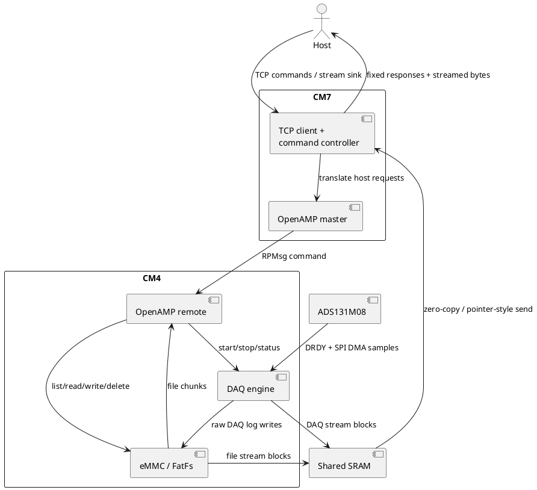
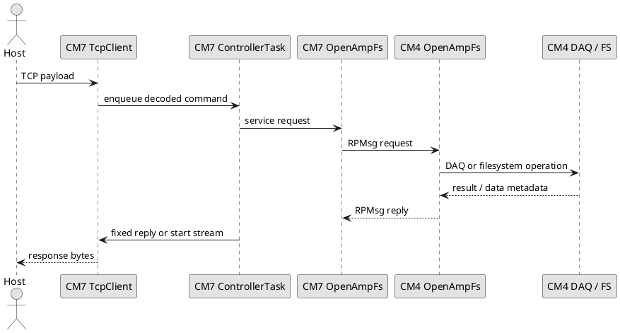

# AEMS Firmware Software Documentation

## Purpose

This firmware runs the Adaptive Energy Monitoring System (AEMS) board built around an STM32H745 dual-core MCU. The board acquires multi-channel electrical measurements through an ADS131M08 ADC, stores captured data to eMMC, and exchanges commands and data with a host computer over Ethernet/TCP.

The design deliberately splits responsibility across both cores:

- **CM4** owns deterministic acquisition, buffering, and eMMC file operations.
- **CM7** owns networking, TCP command handling, host-facing streaming, and supervisory control.

That split is the core architectural decision in this codebase. The firmware is trying to achieve three things at the same time:

1. **capture data deterministically** from the analog front end
2. **persist data safely** to eMMC in a format that can be streamed or decoded later
3. **expose the board as a remotely controlled instrument** through a simple TCP protocol

## Current firmware status

The current codebase implements the following board-level capabilities:

- CM7 TCP client connection to a host Python server
- CM7 command parser and response framing
- CM7 file and DAQ streaming over TCP
- CM4 OpenAMP remote service for filesystem and DAQ control
- CM4 ADS131M08 acquisition pipeline using SPI + DMA + cooperative superloop
- CM4 eMMC filesystem wrapper using FatFs on SDMMC1/MMC
- DAQ logging to eMMC files
- DAQ live streaming from CM4 to CM7 via shared memory
- file count, file list, file size, file delete, and file stream operations

Known current constraints:

- the host tooling and most workflows currently assume **channel mask `0x3F`**
- command `11` eMMC DAQ log files and command `13` live DAQ streams use **different binary layouts**
- CM7/host-side DAQ stop during command `13` still relies on a temporary protocol heuristic and should be cleaned up by a future firmware framing update

## Hardware and software interplay

The firmware is tightly coupled to the board hardware. The main hardware/software boundaries are:

| Hardware block | Firmware owner | Notes |
|---|---|---|
| ADS131M08 ADC | CM4 | Sample clocking, SPI4 DMA reads, DRDY interrupt handling, per-sample packing |
| eMMC on SDMMC1 | CM4 | FatFs mount, file I/O, DAQ raw log writes |
| Ethernet PHY / LwIP | CM7 | Host connectivity, TCP link, command transport |
| Shared SRAM region | CM4 + CM7 | File and DAQ streaming handoff between cores |
| OpenAMP / RPMsg | CM4 + CM7 | Control plane between the two cores |
| HSEM boot synchronization | CM4 + CM7 | Dual-core startup coordination |
| RGB LED | CM7 | Basic board-visible status indication |

### System data flow

## Dual-core role split

### CM4 summary

CM4 is the real-time data plane. It:

- initializes and mounts eMMC
- configures and services the ADS131M08
- runs the DAQ state machine
- aggregates acquired samples into write blocks
- writes DAQ data to eMMC
- provides filesystem and DAQ services to CM7 through OpenAMP

See: [CM4 documentation](CM4/README.md)

### CM7 summary

CM7 is the supervisory and transport plane. It:

- boots FreeRTOS and LwIP
- opens a TCP connection to the host
- receives host commands and maps them to board actions
- calls CM4 OpenAMP services
- streams file and DAQ data over TCP
- frames host-visible responses

See: [CM7 documentation](CM7/README.md)

## Source tree orientation

| Area | Purpose |
|---|---|
| `CM4/Core/Src` | CM4 boot, superloop, OpenAMP remote endpoint |
| `CM4/Library/ads131m08` | ADC driver, DAQ engine, DAQ state machine |
| `CM4/Library/emmc_fs` | FatFs wrapper and raw DAQ log file API |
| `CM7/Core/Src` | CM7 boot, FreeRTOS tasks, OpenAMP master |
| `CM7/Library/eth` | TCP client used by the host-facing command path |
| `CM7/Library/led` | RGB LED helper |
| `Common/Inc` | shared DAQ structures, HSEM IDs, shared-memory definitions |
| `BoardInterfaceLibrary` | Python host library and examples |

## Documentation map

### Core-level documents

- [CM4 / Overview](CM4/README.md)
- [CM7 / Overview](CM7/README.md)

### Library-level documents

#### CM4
- [CM4 Library Index](CM4/Library/README.md)
- [CM4 ads131m08 and DAQ engine](CM4/Library/ads131m08.md)
- [CM4 eMMC filesystem wrapper](CM4/Library/emmc_fs.md)
- [CM4 OpenAMP remote service](CM4/Library/openamp_remote.md)

#### CM7
- [CM7 Library Index](CM7/Library/README.md)
- [CM7 TCP client library](CM7/Library/tcpclient.md)
- [CM7 LED helper library](CM7/Library/led.md)
- [CM7 OpenAMP master service](CM7/Library/openamp_master.md)

## Boot and runtime overview

### Boot sequence

1. CM7 powers up first, configures clocks/cache/MPU, and releases CM4 through HSEM.
2. CM4 wakes, initializes SPI4, SDMMC1, DAQ context, and mounts the eMMC filesystem.
3. CM4 brings up the OpenAMP remote endpoint.
4. CM7 starts FreeRTOS, LwIP, TCP client, and OpenAMP master.
5. The board is then ready to accept host commands.

### Command path overview

## Data formats that matter

Two binary DAQ formats exist today:

### 1. eMMC log file format from command `11`

- selected channels only
- currently channels `0..5`
- each channel stored as signed 32-bit little-endian
- **24 bytes per sample** for current board assumptions

### 2. live DAQ stream format from command `13`

- `response` (`uint16_le`)
- `crc` (`uint16_le`)
- `channel[0..7]` as eight signed 32-bit little-endian values
- **36 bytes per frame**

This distinction is important in both firmware and host tooling.

## Recommended reading order

1. read this page first
2. read [CM4 / Overview](CM4/README.md)
3. read [CM7 / Overview](CM7/README.md)
4. use the library pages for function-level interface details
