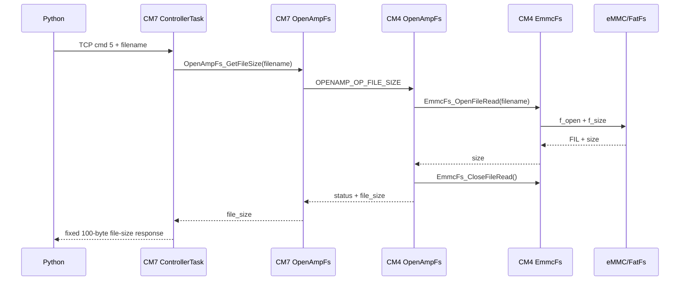
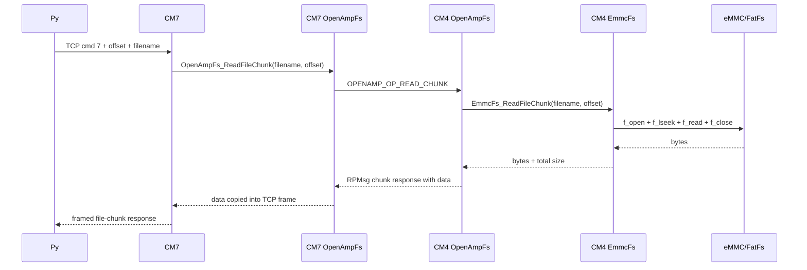
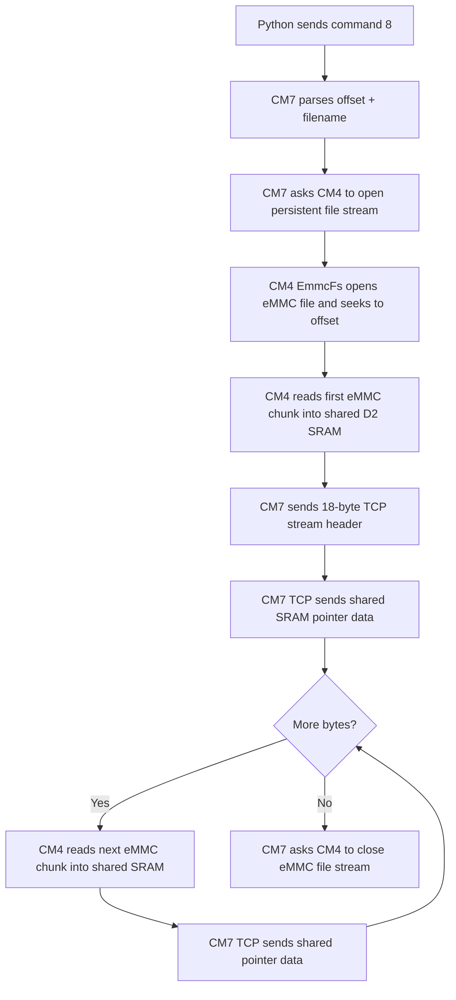
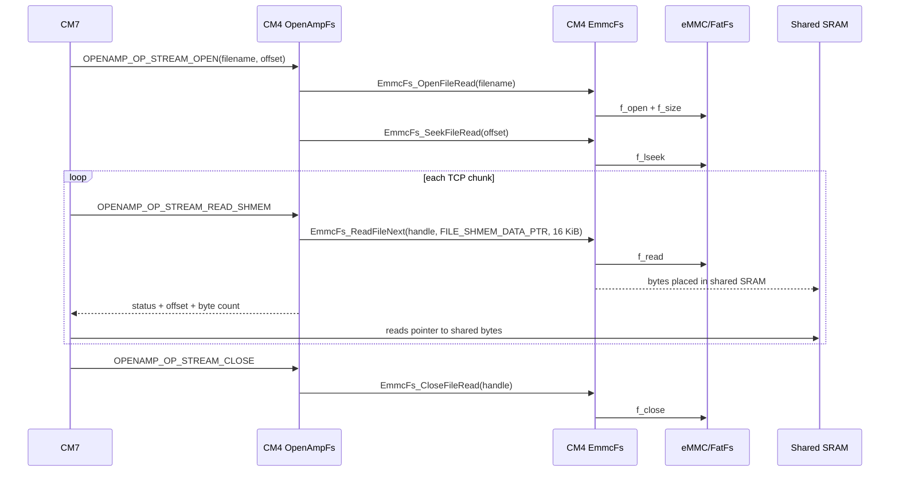

# File Streaming Overview

This document gives a concise end-to-end view of how file streaming works across Python, CM7, CM4, TCP, OpenAMP, eMMC, and shared SRAM.

For API details, see:

- `docs/Software/openamp_fs.md`
- `docs/Software/tcpclient.md`
- `docs/Software/CM4/emmc_fs.md`

## Core Responsibilities

| Component | Responsibility |
|---|---|
| Python test tool | Sends TCP commands and receives status/stream data. |
| CM7 ControllerTask | Parses TCP commands and coordinates TCP/OpenAMP operations. |
| CM7 TcpClient | Maintains socket connection and sends responses/streams. |
| CM7 OpenAmpFs | Sends file operation requests to CM4. |
| CM4 OpenAmpFs | Receives OpenAMP requests and calls eMMC/FatFs wrappers. |
| CM4 EmmcFs | Owns all eMMC/FatFs operations: mount, file counts, open, seek, read, close. |
| Shared D2 SRAM | Bulk file data buffer for command `8`. |

## CM4 eMMC Role

CM4 is the only core that touches the eMMC/FatFs stack. CM7 never calls the eMMC driver or FatFs directly. CM7 only sends file operation requests to CM4 through OpenAMP.

This split is deliberate:

- CM4 initializes SDMMC/eMMC and mounts the FatFs volume.
- CM4 keeps persistent FatFs file handles for streaming.
- CM4 reads file bytes from eMMC into either an RPMsg response buffer or the shared SRAM stream buffer.
- CM7 owns TCP and only sends the bytes it receives or reads from shared SRAM.

The core boundary is:

```text
CM7 TCP command -> CM7 OpenAmpFs request -> CM4 OpenAmpFs handler -> CM4 EmmcFs -> FatFs/eMMC
```

For command `8`, eMMC is in the producer side of the stream:

```text
CM4 eMMC read -> shared D2 SRAM -> CM7 TCP pointer send -> Python receiver
```

For detailed CM4 filesystem APIs, see `docs/Software/CM4/emmc_fs.md`.

## Command Summary

| Command | Purpose | Current Status |
|---:|---|---|
| `0` | TCP heartbeat | implemented |
| `2` | `.dat` file count | implemented via CM4/OpenAMP |
| `3` | total file count | implemented via CM4/OpenAMP |
| `5` | file size | implemented via CM4/OpenAMP |
| `7` | one chunk read | implemented via direct RPMsg chunk response |
| `8` | full file stream | implemented via shared SRAM + TCP pointer stream |
| `9` | synthetic TCP stream | implemented locally on CM7 |
| `99` | OpenAMP heartbeat and diagnostics | implemented |

## File Size Request: Command 5



## One-Chunk Read: Command 7

Command `7` is a debug-oriented chunk read. It returns a framed response containing the requested file data inside the TCP response frame.



Use this for validation, not high throughput.

## Full Stream: Command 8

Command `8` is the main file streaming path.



Current implementation is single-buffered:

```text
read one shared buffer -> send that buffer -> read next buffer -> send next buffer
```

The shared buffer is `16 KiB` and lives in D2 SRAM.

The CM4-side filesystem sequence for command `8` is:



## Healthy Diagnostic Output

A healthy command `99` should include:

```text
status=0
tcp=1
fs_status=0
service_created=1
init_status=0
remote_init_status=0
remote_mount_status=0
shmem_probe_status=0
shmem_probe_len=256
shmem_probe_bad_index=0xFFFFFFFF
```

If `shmem_probe_status != 0`, fix shared SRAM before testing command `8`.

## Common Failure Modes

| Symptom | Likely Cause | Next Check |
|---|---|---|
| `99` timeout or `service_created=0` | OpenAMP endpoint not ready | CM4 `OpenAmpFs_RemoteInit()`, CM7 lazy init path |
| `shmem_probe_status=-4` | CM4 did not reply to probe; often memory collision/fault | linker reservation and CM4/CM7 aliases |
| `shmem_probe_status=-7` | CM7 read data differs from CM4 written data | MPU/cache attributes or wrong alias |
| Command `8`: `Stream is empty or unavailable` | open or first shared read failed | run `99` and inspect `stream_open_status`, `stream_prefetch_status`, `stream_prefetch_len` |
| Command `8` pattern failure | wrong offset, stale cache, buffer corruption | MPU non-cacheable region and shared address definitions |

## Current Performance Baseline

Best known command `8` setup:

```text
16 KiB shared SRAM chunk
single shared buffer
CM7 TCP pointer streaming directly from shared SRAM
```

Measured throughput:

```text
~2.9 MiB/s for 1 MiB test.dat
```

The next planned performance step is true double-buffering with asynchronous OpenAMP read-start/read-complete handling.
