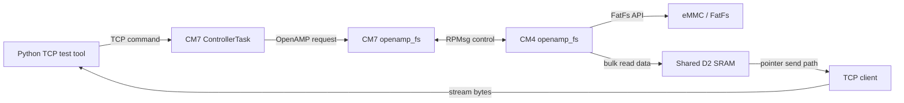
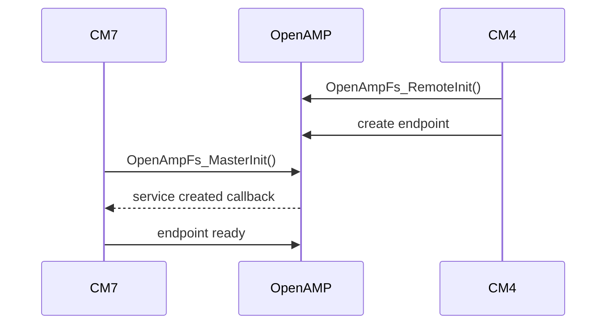
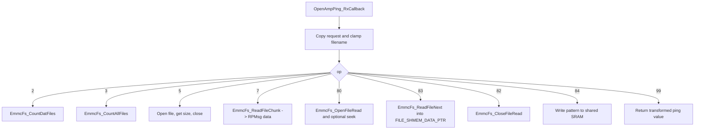
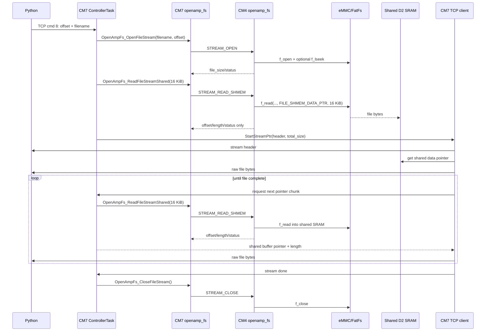

# OpenAMP File System Bridge

This document describes the OpenAMP file-system bridge between the STM32H745 cores.

- **CM7** owns TCP/LwIP and receives commands from the Python test server.
- **CM4** owns eMMC/FatFs and performs all file-system operations.
- **OpenAMP/RPMsg** carries control messages between CM7 and CM4.
- **Shared D2 SRAM** carries bulk file data for the high-throughput command `8` stream path.

## Source Files

| Core | File | Role |
|---|---|---|
| CM7 | `CM7/Core/Inc/openamp_fs.h` | Public CM7 OpenAMP file API used by FreeRTOS controller code. |
| CM7 | `CM7/Core/Src/openamp_fs.c` | OpenAMP master endpoint, request/response wait logic, CM7-side helpers. |
| CM4 | `CM4/Core/Inc/openamp_fs.h` | Public CM4 OpenAMP polling/init API. |
| CM4 | `CM4/Core/Src/openamp_fs.c` | OpenAMP remote endpoint and dispatch to eMMC/FatFs operations. |
| Common | `Common/Inc/file_shmem.h` | Shared SRAM fixed-address aliases and buffer sizing. |
| CM4 | `CM4/Library/emmc_fs/*` | eMMC/FatFs wrapper functions used by the CM4 OpenAMP server. |

## Architecture



## Shared SRAM Layout

The file stream data buffer is a reserved 32 KiB block in D2 SRAM. Both cores access the same physical memory through different aliases.

| Core | Address Alias | Defined In |
|---|---:|---|
| CM7 | `0x30000000` | `FILE_SHMEM_BASE_ADDR` when `CORE_CM7` is defined |
| CM4 | `0x10000000` | `FILE_SHMEM_BASE_ADDR` when `CORE_CM4` is defined |

Current buffer settings:

```c
#define FILE_SHMEM_REGION_SIZE    (32U * 1024U)
#define FILE_SHMEM_DATA_OFFSET    0x100U
#define FILE_SHMEM_DATA_LEN       (16U * 1024U)
#define FILE_SHMEM_DATA_ADDR      (FILE_SHMEM_BASE_ADDR + FILE_SHMEM_DATA_OFFSET)
#define FILE_SHMEM_DATA_PTR       ((uint8_t *)FILE_SHMEM_DATA_ADDR)
```

The first `0x100` bytes are reserved for future metadata. Command `8` currently uses one data buffer at `FILE_SHMEM_DATA_PTR`.

### Linker Reservation

Both cores reserve the same physical D2 SRAM block so normal variables do not collide with the shared file buffer.

CM7 linker:

```ld
SHARED_RAM (xrw) : ORIGIN = 0x30000000, LENGTH = 32K
RAM_D2     (xrw) : ORIGIN = 0x30008000, LENGTH = 224K
```

CM4 linker:

```ld
SHARED_RAM (xrw) : ORIGIN = 0x10000000, LENGTH = 32K
RAM        (xrw) : ORIGIN = 0x10008000, LENGTH = 256K
```

Both linkers also provide a `.shared_ram (NOLOAD)` section for future explicit shared objects.

### MPU Requirement

CM7 must mark the shared file region as non-cacheable:

```c
BaseAddress = 0x30000000;
Size        = MPU_REGION_SIZE_32KB;
Cacheable   = MPU_ACCESS_NOT_CACHEABLE;
Bufferable  = MPU_ACCESS_NOT_BUFFERABLE;
Shareable   = MPU_ACCESS_SHAREABLE;
DisableExec = MPU_INSTRUCTION_ACCESS_DISABLE;
```

This avoids CM7 D-cache coherency problems when CM4 writes file bytes into D2 SRAM.

## OpenAMP Channel

Both cores use this RPMsg channel:

```c
#define OPENAMP_PING_CHAN_NAME "openamp_pingpong_demo"
```

CM7 initializes as OpenAMP master. CM4 initializes as OpenAMP remote.



## Message Structures

CM7 sends one request structure for all operations:

```c
typedef struct
{
  uint32_t op;
  uint32_t value;
  uint32_t length;
  char filename[64];
} OpenAmpPingRequest_t;
```

| Field | Meaning |
|---|---|
| `op` | OpenAMP operation ID. |
| `value` | Generic request value: ping value, file offset, or reserved. |
| `length` | Requested byte count for read operations. |
| `filename` | Null-terminated filename for operations that open/read named files. |

Small responses use:

```c
typedef struct
{
  uint32_t op;
  int32_t status;
  uint32_t value;
  uint32_t offset;
  uint32_t length;
  int32_t init_status;
  int32_t mount_status;
} OpenAmpSmallResponse_t;
```

Chunk responses for direct RPMsg data reads use:

```c
typedef struct
{
  uint32_t op;
  int32_t status;
  uint32_t value;
  uint32_t offset;
  uint32_t length;
  int32_t init_status;
  int32_t mount_status;
  uint8_t data[OPENAMP_CHUNK_LEN];
} OpenAmpChunkResponse_t;
```

## Operation IDs

| Op | Name | Data Path | Purpose |
|---:|---|---|---|
| `2` | `OPENAMP_OP_COUNT_DAT` | RPMsg metadata | Count `.dat` files. |
| `3` | `OPENAMP_OP_COUNT_ALL` | RPMsg metadata | Count all files. |
| `5` | `OPENAMP_OP_FILE_SIZE` | RPMsg metadata | Open file and return size. |
| `7` | `OPENAMP_OP_READ_CHUNK` | RPMsg data | One-shot file chunk read for debug. |
| `80` | `OPENAMP_OP_STREAM_OPEN` | RPMsg metadata | Open persistent CM4 file stream. |
| `81` | `OPENAMP_OP_STREAM_READ` | RPMsg data | Legacy/read-next via RPMsg payload. |
| `82` | `OPENAMP_OP_STREAM_CLOSE` | RPMsg metadata | Close persistent CM4 file stream. |
| `83` | `OPENAMP_OP_STREAM_READ_SHMEM` | Shared SRAM | Read next stream chunk into shared D2 SRAM. |
| `84` | `OPENAMP_OP_SHMEM_PROBE` | Shared SRAM | Probe CM4 write / CM7 read of shared SRAM. |
| `99` | `OPENAMP_OP_PING` | RPMsg metadata | OpenAMP heartbeat/status. |

## CM7 API Reference

### `int32_t OpenAmpFs_MasterInit(void)`

Initializes the CM7 OpenAMP master side. It is also called lazily by the request path if OpenAMP is not initialized yet.

Returns:
- `0` on success.
- OpenAMP/HAL error code on initialization failure.

### `int32_t OpenAmpFs_Ping(uint32_t request_value, uint32_t *reply_value)`

Sends a heartbeat/ping to CM4.

Arguments:
- `request_value`: arbitrary value generated by CM7.
- `reply_value`: output pointer for CM4 reply value.

Returns `0` on successful exchange, or a negative local/OpenAMP error.

### `int32_t OpenAmpFs_CountDatFiles(uint32_t *dat_count)`

Requests CM4 to count files ending in `.dat`.

Arguments:
- `dat_count`: output pointer for count.

Returns `0` on success or an eMMC/OpenAMP status on failure.

### `int32_t OpenAmpFs_CountAllFiles(uint32_t *file_count)`

Requests CM4 to count all files in the eMMC root directory.

Arguments:
- `file_count`: output pointer for count.

Returns `0` on success or an error status.

### `int32_t OpenAmpFs_GetFileSize(const char *filename, uint32_t *file_size)`

Requests CM4 to open a file and return its size.

Arguments:
- `filename`: null-terminated file name or path.
- `file_size`: output pointer for file size in bytes.

Returns `0` on success, `-1` for invalid local arguments, or a CM4 status on remote failure.

### `int32_t OpenAmpFs_ReadFileChunk(...)`

```c
int32_t OpenAmpFs_ReadFileChunk(const char *filename,
                                uint32_t offset,
                                uint8_t *buffer,
                                uint16_t buffer_size,
                                uint16_t *bytes_read,
                                uint32_t *total_size);
```

Reads one file chunk through RPMsg. TCP command `7` uses this as a debug/single-chunk operation.

Arguments:
- `filename`: file to read.
- `offset`: byte offset in file.
- `buffer`: destination buffer on CM7.
- `buffer_size`: maximum bytes to request/copy.
- `bytes_read`: output bytes actually read.
- `total_size`: output total file size.

Returns `0` on success or an OpenAMP/CM4 eMMC status on failure.

### `int32_t OpenAmpFs_OpenFileStream(...)`

```c
int32_t OpenAmpFs_OpenFileStream(const char *filename,
                                 uint32_t offset,
                                 uint32_t *file_size);
```

Opens a persistent file read handle on CM4.

Arguments:
- `filename`: file to stream.
- `offset`: starting byte offset.
- `file_size`: output total file size.

Returns `0` on success or an error if CM4 cannot open/seek the file.

### `int32_t OpenAmpFs_ReadFileStream(...)`

Legacy persistent stream read where file bytes are returned inside the RPMsg response. Command `8` no longer uses this; it is kept for fallback/debug.

Arguments:
- `buffer`: CM7 destination buffer.
- `buffer_size`: maximum bytes requested.
- `bytes_read`: output bytes copied from RPMsg response.
- `offset`: output offset of this chunk.
- `total_size`: output total file size.

### `int32_t OpenAmpFs_ReadFileStreamShared(...)`

```c
int32_t OpenAmpFs_ReadFileStreamShared(uint8_t **buffer,
                                       uint16_t buffer_size,
                                       uint16_t *bytes_read,
                                       uint32_t *offset,
                                       uint32_t *total_size);
```

Requests CM4 to read the next persistent stream chunk into shared D2 SRAM.

Arguments:
- `buffer`: output pointer set to `FILE_SHMEM_DATA_PTR` on CM7.
- `buffer_size`: maximum bytes to request. Clamped to `FILE_SHMEM_DATA_LEN`.
- `bytes_read`: output bytes written by CM4 into shared SRAM.
- `offset`: output file offset of the chunk.
- `total_size`: output total file size.

Returns `0` on success or an error status.

### `int32_t OpenAmpFs_ProbeSharedMemory(uint32_t *probe_len, uint32_t *bad_index)`

Tests shared SRAM visibility between CM4 and CM7.

Arguments:
- `probe_len`: output length of test pattern written by CM4.
- `bad_index`: output bad byte index on verification failure, or `0xFFFFFFFF` on success.

Returns:
- `0` if CM4 wrote the pattern and CM7 verified it.
- `-4` if CM7 timed out waiting for CM4 response.
- `-6` if response magic is wrong.
- `-7` if data verification failed.

### `int32_t OpenAmpFs_CloseFileStream(void)`

Closes the persistent CM4 file stream handle.

Returns `0` on success or CM4/OpenAMP status on failure.

### Diagnostic Getters

| Function | Meaning |
|---|---|
| `OpenAmpFs_GetServiceCreated()` | Whether CM7 has seen the CM4 RPMsg service. |
| `OpenAmpFs_GetRxCount()` | Count of OpenAMP responses received by CM7. |
| `OpenAmpFs_GetInitStatus()` | CM7 OpenAMP init status. |
| `OpenAmpFs_GetRemoteInitStatus()` | Last CM4 eMMC init status reported in response. |
| `OpenAmpFs_GetRemoteMountStatus()` | Last CM4 eMMC mount status reported in response. |

## CM4 API Reference

### `int32_t OpenAmpFs_RemoteInit(void)`

Initializes CM4 as the OpenAMP remote endpoint and creates the `openamp_pingpong_demo` endpoint.

Returns `0` on success or an OpenAMP initialization/endpoint creation error.

### `void OpenAmpFs_RemotePoll(void)`

Polls OpenAMP for incoming messages. CM4 calls this repeatedly from the bare-metal main loop.

### `int32_t OpenAmpFs_GetRemoteInitStatus(void)`

Returns CM4 OpenAMP initialization status.

### `uint32_t OpenAmpFs_GetRemoteRxCount(void)`

Returns the number of OpenAMP requests handled by CM4.

## CM4 Request Handling



## TCP Command Mapping

| TCP Command | CM7 Action | OpenAMP Operations Used |
|---:|---|---|
| `0` | Local TCP heartbeat | none |
| `2` | Return `.dat` file count | `OPENAMP_OP_COUNT_DAT` |
| `3` | Return total file count | `OPENAMP_OP_COUNT_ALL` |
| `5` | Return named file size | `OPENAMP_OP_FILE_SIZE` |
| `7` | Return one framed file chunk | `OPENAMP_OP_READ_CHUNK` |
| `8` | Stream full file over TCP | `STREAM_OPEN`, `STREAM_READ_SHMEM`, `STREAM_CLOSE` |
| `9` | Local synthetic TCP stream test | none |
| `99` | OpenAMP heartbeat and diagnostics | `PING`, `SHMEM_PROBE` |

## Command 8 File Streaming



## Diagnostics Through Command 99

TCP command `99` reports OpenAMP and shared-memory status:

| Field | Meaning |
|---|---|
| `reply` | CM4 transformed ping reply. |
| `fs_status` | Status of `OpenAmpFs_Ping`. |
| `service_created` | CM7 sees CM4 RPMsg endpoint. |
| `rx_count` | CM7 OpenAMP response count. |
| `init_status` | CM7 OpenAMP init status. |
| `remote_init_status` | CM4 eMMC init status from last response. |
| `remote_mount_status` | CM4 eMMC mount status from last response. |
| `shmem_probe_status` | Result of shared SRAM probe. `0` means CM4 write / CM7 read passed. |
| `shmem_probe_len` | Probe bytes verified. |
| `shmem_probe_bad_index` | Bad byte index, or `0xFFFFFFFF` on success. |
| `stream_open_status` | Last command `8` stream-open status. |
| `stream_prefetch_status` | Last command `8` initial shared-read status. |
| `stream_prefetch_len` | Last command `8` initial shared-read length. |

A healthy baseline looks like:

```text
shmem_probe_status=0
shmem_probe_len=256
shmem_probe_bad_index=0xFFFFFFFF
remote_init_status=0
remote_mount_status=0
```

## Current Performance Notes

Measured command `8` performance history:

| Stage | Approx Throughput |
|---|---:|
| Direct RPMsg original | `0.33 MiB/s` |
| Persistent CM4 file session | `0.49 MiB/s` |
| Larger RPMsg chunks | `0.98 MiB/s` |
| Fast OpenAMP wait | `1.46 MiB/s` |
| Shared SRAM single buffer with copy | `2.23 MiB/s` |
| Shared SRAM direct pointer streaming | `2.91 MiB/s` |

Best known chunk size is currently `16 KiB`. A `24 KiB` chunk was tested and was slower in this setup.

## Future Improvements

- Double-buffer shared SRAM so CM4 can read one buffer while CM7 sends the other.
- Make OpenAMP stream reads asynchronous to get true read/send overlap.
- Add a final stream status frame if mid-stream errors need explicit reporting to Python.
- Consider TCP send tuning if LwIP socket sends become the dominant bottleneck.
