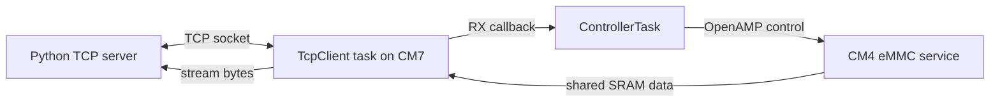
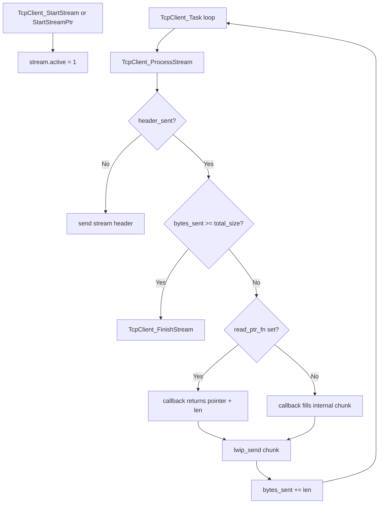
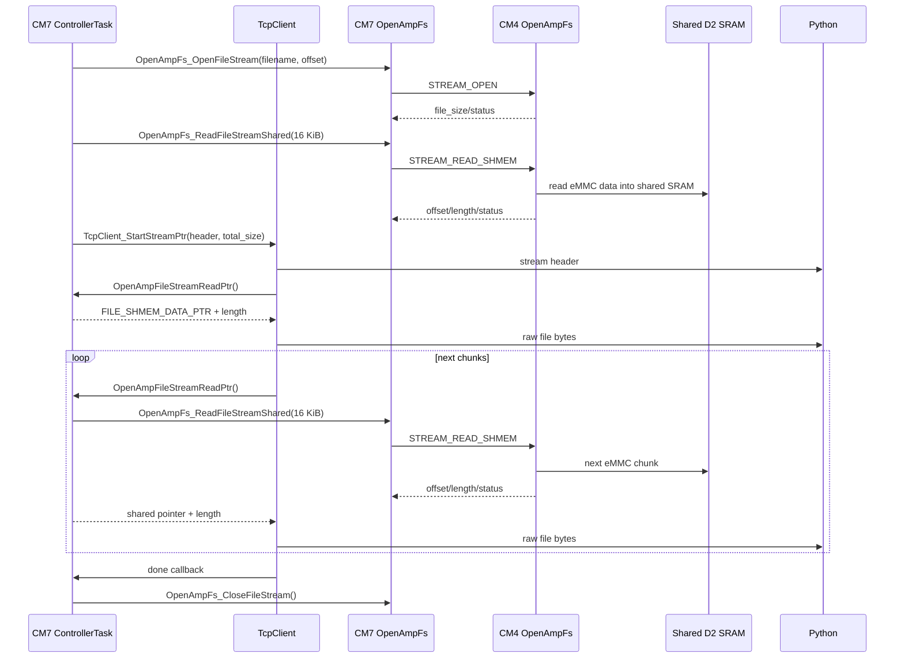

# TCP Client

This document describes the CM7 TCP client used to connect to the Python test server and stream data.

The TCP client lives on CM7 only.

## Source Files

| File | Role |
|---|---|
| `CM7/Library/eth/tcpclient.h` | Public TCP client API. |
| `CM7/Library/eth/tcpclient.c` | LwIP socket task, TX queue, stream engine. |
| `CM7/Core/Src/freertos.c` | Creates the TCP client and maps incoming TCP commands to controller actions. |
| `UnitTests/tcptest.py` | Python TCP server used to send commands and receive responses/streams. |

## Role in the System



The TCP client handles:

- connecting to the configured Python server
- receiving fixed-size command packets
- queueing fixed responses
- streaming raw bytes after a small stream header
- reconnecting when the socket fails

## Configuration Constants

From `tcpclient.h`:

| Constant | Default | Meaning |
|---|---:|---|
| `TCPCLIENT_TX_MSG_MAX_LEN` | `1460` | Max queued fixed-message payload copied into TX mailbox. |
| `TCPCLIENT_TX_MBOX_SIZE` | `128` | LwIP mailbox depth for queued fixed messages. |
| `TCPCLIENT_RX_TIMEOUT_MS` | `1000` | `select()` timeout for socket receive path. |
| `TCPCLIENT_RECONNECT_DELAY_MS` | `1000` | Delay between reconnect attempts. |
| `TCPCLIENT_LINK_WAIT_MS` | `250` | Link wait constant, currently not central to stream path. |

From `tcpclient.c`:

| Constant | Current | Meaning |
|---|---:|---|
| `TCPCLIENT_CONNECT_TIMEOUT_MS` | `1000` | Nonblocking connect timeout. |
| `TCPCLIENT_RX_BUFFER_LEN` | `100` | RX packet buffer size for incoming commands. |
| `TCPCLIENT_STREAM_CHUNK_LEN` | `16 KiB` | Max bytes requested from stream callback per stream iteration. |

## Public Types

### `TcpClientRxHandler_t`

```c
typedef void (*TcpClientRxHandler_t)(const char *data, uint16_t length);
```

Called by the TCP task when command bytes arrive from the server.

Arguments:
- `data`: pointer to received bytes. Valid only during callback.
- `length`: number of received bytes, capped by `TCPCLIENT_RX_BUFFER_LEN`.

Used by `ProcessTcpData()` in `CM7/Core/Src/freertos.c`.

### `TcpClientStreamReadFn`

```c
typedef int32_t (*TcpClientStreamReadFn)(void *context,
                                         uint8_t *buffer,
                                         uint16_t max_len,
                                         uint16_t *out_len);
```

Copy/fill stream callback. The callback writes bytes into the provided TCP client buffer.

Arguments:
- `context`: user pointer supplied to `TcpClient_StartStream()`.
- `buffer`: destination buffer to fill.
- `max_len`: maximum bytes that can be written.
- `out_len`: output number of bytes written.

Returns:
- `0` if data is available.
- nonzero to stop/fail the stream.

Used by command `9` synthetic stream test.

### `TcpClientStreamReadPtrFn`

```c
typedef int32_t (*TcpClientStreamReadPtrFn)(void *context,
                                            const uint8_t **out_data,
                                            uint16_t max_len,
                                            uint16_t *out_len);
```

Pointer stream callback. The callback returns a pointer to an existing buffer that TCP should send directly.

Arguments:
- `context`: user pointer supplied to `TcpClient_StartStreamPtr()`.
- `out_data`: output pointer to bytes to send.
- `max_len`: maximum length TCP client is willing to send in this iteration.
- `out_len`: output byte count at `*out_data`.

Returns:
- `0` if data is available.
- nonzero to stop/fail the stream.

Used by command `8` file streaming from shared D2 SRAM.

### `TcpClientStreamDoneFn`

```c
typedef void (*TcpClientStreamDoneFn)(void *context);
```

Called when a stream completes or is aborted.

Arguments:
- `context`: stream context pointer supplied at stream start.

Command `8` uses this to close the CM4 persistent file stream.

### `TcpClientConfig_t`

```c
typedef struct
{
    ip_addr_t ServerIp;
    uint16_t ServerPort;
    struct netif *Netif;
    TcpClientRxHandler_t RxHandler;
} TcpClientConfig_t;
```

Fields:
- `ServerIp`: remote Python server IP.
- `ServerPort`: remote TCP port.
- `Netif`: LwIP network interface.
- `RxHandler`: callback invoked when command data arrives.

## Public API

### `void TcpClient_BuildConfig(...)`

```c
void TcpClient_BuildConfig(TcpClientConfig_t *config,
                           const ip_addr_t *serverIp,
                           uint16_t serverPort,
                           struct netif *netif,
                           TcpClientRxHandler_t rxHandler);
```

Populates a `TcpClientConfig_t`.

Arguments:
- `config`: destination config object.
- `serverIp`: pointer to IPv4/IPv6 server address.
- `serverPort`: server TCP port.
- `netif`: LwIP network interface used for link status checks.
- `rxHandler`: receive callback for command packets.

Usage in `StartDefaultTask()`:

```c
IP4_ADDR(&tcpServerIp, 192, 168, 0, 20);
TcpClient_BuildConfig(&tcpCfg, &tcpServerIp, 10U, &gnetif, ProcessTcpData);
```

### `int32_t TcpClient_Init(const TcpClientConfig_t *config)`

Initializes the TCP client state, TX mailbox, mutex, and socket task.

Arguments:
- `config`: initialized TCP client config.

Returns:
- `0` on success or if already initialized.
- `-1` for invalid config.
- `-2` if TX mailbox creation fails.
- `-3` if mutex creation fails.
- `-4` if TCP task creation fails.

### `int32_t TcpClient_SendBuffer(const uint8_t *data, uint16_t length)`

Queues a fixed response buffer for transmission.

Arguments:
- `data`: bytes to send.
- `length`: byte count.

Returns:
- `0` on queued successfully.
- `-1` if not initialized, null data, or zero length.
- `-2` if allocation fails.
- `-3` if TX mailbox is full.

Notes:
- If `length > TCPCLIENT_TX_MSG_MAX_LEN`, length is clamped.
- Used for 100-byte responses such as commands `0`, `2`, `3`, `5`, and `99`.

### `int32_t TcpClient_StartStream(...)`

```c
int32_t TcpClient_StartStream(const uint8_t *header,
                              uint16_t header_len,
                              uint32_t total_size,
                              TcpClientStreamReadFn read_fn,
                              TcpClientStreamDoneFn done_fn,
                              void *context);
```

Starts a copy/fill stream. TCP first sends `header`, then repeatedly calls `read_fn()` to fill the internal stream buffer.

Arguments:
- `header`: stream header bytes sent before raw data.
- `header_len`: header length.
- `total_size`: total raw data bytes expected after header.
- `read_fn`: callback that fills TCP buffer.
- `done_fn`: optional callback at stream completion/abort.
- `context`: user context passed to callbacks.

Returns:
- `0` on stream start.
- `-1` for invalid arguments or client not initialized.
- `-2` if a stream is already active.

Used by command `9`.

### `int32_t TcpClient_StartStreamPtr(...)`

```c
int32_t TcpClient_StartStreamPtr(const uint8_t *header,
                                 uint16_t header_len,
                                 uint32_t total_size,
                                 TcpClientStreamReadPtrFn read_ptr_fn,
                                 TcpClientStreamDoneFn done_fn,
                                 void *context);
```

Starts a pointer-based stream. TCP first sends `header`, then repeatedly calls `read_ptr_fn()` and sends directly from the returned pointer.

Arguments:
- `header`: stream header bytes sent before raw data.
- `header_len`: header length.
- `total_size`: total raw data bytes expected after header.
- `read_ptr_fn`: callback that returns a pointer/length to send.
- `done_fn`: optional completion/abort callback.
- `context`: user context passed to callbacks.

Returns:
- `0` on stream start.
- `-1` for invalid arguments or client not initialized.
- `-2` if a stream is already active.

Used by command `8`. The returned pointer is `FILE_SHMEM_DATA_PTR`.

### `int32_t TcpClient_Send(const char *text)`

Queues a null-terminated string.

Arguments:
- `text`: null-terminated string.

Returns the same underlying status as `TcpClient_SendBuffer()`.

### `uint8_t TcpClient_IsConnected(void)`

Returns TCP connection state:
- `1` when connected.
- `0` when disconnected.

### `void TcpClient_RequestReconnect(void)`

Requests the TCP task to close the current socket and reconnect.

## Internal Stream Flow



## Command 8 File Stream Integration

Command `8` uses pointer streaming with shared SRAM.



## TCP Frame Formats

### Fixed 100-byte Responses

Most commands send a fixed 100-byte response:

| Offset | Size | Meaning |
|---:|---:|---|
| `0` | 1 | command |
| `1` | 4 | server ID, big-endian |
| `5` | 8 | epoch time, big-endian |
| `13` | 1 | status |
| `14` | 1 | TCP connected flag |
| `15+` | variable | command-specific fields |

### Stream Header

Commands `8` and `9` send an 18-byte stream header before raw data:

| Offset | Size | Meaning |
|---:|---:|---|
| `0` | 1 | command |
| `1` | 1 | stream status |
| `2` | 4 | server ID |
| `6` | 8 | epoch time |
| `14` | 4 | total raw bytes to follow |

After the stream header, all following bytes are raw stream payload until `total_size` bytes are received.

## Current Best-Known Settings

| Setting | Value |
|---|---:|
| Shared SRAM region | `32 KiB` |
| File shared data length | `16 KiB` |
| TCP stream chunk length | `16 KiB` |
| Command `8` data path | shared SRAM + pointer streaming |

Measured command `8` throughput with this path is approximately `2.9 MiB/s` for a 1 MiB test file.

## Future Work

- Double-buffer the shared SRAM region.
- Make OpenAMP stream reads asynchronous so CM4 can fill one buffer while CM7 sends the other.
- Add stream-end status/error frame for mid-stream failure reporting.
- Consider TCP send tuning if LwIP socket sends become the dominant bottleneck.
