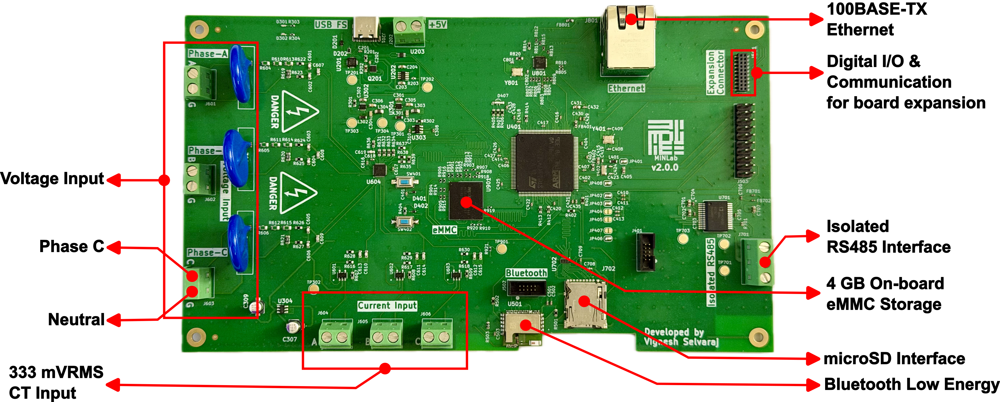

# AEMS Hardware — Energy Monitoring System Board

KiCad design for the AEMS v2 data-acquisition board: a custom, multi-channel energy-monitoring
front end built around the **ADS131M08** ADC and the **STM32H745** dual-core MCU. This is the
hardware layer of the [Autonomous Energy Monitoring System](../README.md) and is designed to be
reproduced, modified, and manufactured by others.

The KiCad project root is `EnergyMonitoringSystem.kicad_pro`.

---

## Board overview

The board acquires multi-channel voltage and current signals at a high, simultaneous sampling
rate, digitizes them through the ADS131M08 analog front end, and hands the data to the STM32H745
for on-board logging and network streaming.

Key design features:

- **ADS131M08** — 8-channel, 24-bit, simultaneous-sampling delta-sigma ADC front end.
- **STM32H745** dual-core (Cortex-M7 + Cortex-M4) host MCU with eMMC and Ethernet.
- **Isolated power rails** feeding the analog front end and digital domains.
- **Impedance-controlled, multilayer PCB** (100 Ω differential / 50 Ω single-ended Ethernet,
  90 Ω USB) — see the impedance and stackup exports in [`DesignSummary/`](DesignSummary/).
- **MOV-based surge protection** on the measurement inputs.
- **Ethernet** and **on-board eMMC** for autonomous, network-independent logging.

The current firmware/host workflows use a **6-channel acquisition mask (`0x3F`)** — three voltage and three current channels.

> **Input voltage topology:** the present design is validated for its rated direct-measurement
> input topology. Measuring higher line-to-line service voltages (e.g. 480 V L-L) exceeds the
> on-board MOV continuous ratings and requires an updated **MOV surge protector (upto a certain voltage level)** or **external potential transformer**. This is
> consistent with the modular design intent and is tracked under
> [`FutureUpdates/`](FutureUpdates/).



---

## Board Power-Up

Temporarily, due to a design issue, the board needs to be powered on as shown in the figure below. This design issue will be fixed in the next hardware version. 


---

## Project structure

```
hardware/
├── EnergyMonitoringSystem.kicad_pro   KiCad project
├── EnergyMonitoringSystem.kicad_sch   Root schematic
├── EnergyMonitoringSystem.kicad_pcb   PCB layout
├── *.kicad_sch                        Hierarchical sheets (see below)
├── CustomLibs/                        Project symbol/footprint libraries
│   ├── EMS.kicad_sym                  Custom symbols
│   ├── EMS.pretty/                    Custom footprints
│   └── Downloaded/                    Third-party part libs (ADS131M08, MOV, op-amps, …)
├── LTSpiceSimulation/                 Analog front-end simulations (CT op-amp, rough studies)
├── Datasheets/                        Component reference material
├── ApplicationNotes/                  ST H7 hardware development notes
├── DesignSummary/                     Stackup, impedance control, interactive BOM
├── Manufacturing/PCBWay/              Fabrication + assembly outputs (Gerbers, drill, BOM, CPL)
└── FutureUpdates/Planned/             Planned revisions (front-end isolation, etc.)
```

### Schematic sheets

The design is hierarchical. The main functional sheets are:

| Sheet | Function |
|---|---|
| `adc` | ADS131M08 analog front end and signal conditioning |
| `uC` / `uCMain` | STM32H745 microcontroller and support |
| `ethernet` | Ethernet PHY (LAN8742) and magnetics |
| `poe` | Ethernet input (No PoE setup currently) |
| `vr` | Voltage regulation / power rails |
| `emmc` | eMMC storage |
| `sd_card` | SD card interface |
| `usb` | USB interface |
| `bm` | Bluetooth (BlueNRG) module |

---

## Bill of materials

- **Interactive BOM:** open [`DesignSummary/ibom.html`](DesignSummary/ibom.html) in a browser
  for a searchable, click-to-highlight BOM with board placement.
- **Fabrication BOM / placement:**
  [`Manufacturing/PCBWay/EnergyMonitoringSystem.kicad_pcb/PCBWay_bom.csv`](Manufacturing/PCBWay/EnergyMonitoringSystem.kicad_pcb/PCBWay_bom.csv)
  and `PCBWay_positions.csv` (component placement / CPL).

---

## Manufacturing

Ready-to-fabricate outputs (generated for PCBWay) are in
[`Manufacturing/PCBWay/`](Manufacturing/PCBWay/) or you generated your own from the KiCAD project:

- Gerbers (`F_Cu`, `B_Cu`, `In1..In6_Cu`, mask, paste, silkscreen, edge cuts)
- Drill files (`PTH`, `NPTH`)
- `PCBWay_bom.csv` (BOM) and `PCBWay_positions.csv` (pick-and-place)
- `PCBWay_netlist.ipc` (IPC-356 netlist)
- `DesignRequirements.pdf` and `Jump-SolderBridges.png` (assembly notes)

Stackup and impedance targets are documented in [`DesignSummary/`](DesignSummary/)
(`CurrentStackup.png`, `PCBWay Stackup.png`, and the `ImpedanceControl *.png` exports).

To regenerate outputs, open `EnergyMonitoringSystem.kicad_pcb` in KiCad and re-plot Gerbers/drill
and re-export the BOM/placement.

---

## Requirements

- **KiCad 7** or newer to open the project.
- Custom and downloaded libraries under [`CustomLibs/`](CustomLibs/) are referenced via the
  project-local `sym-lib-table` / `fp-lib-table`, so the project should open self-contained.

---

## Future updates

Planned hardware revisions are tracked in [`FutureUpdates/Planned/`](FutureUpdates/Planned/),
including improved analog front-end **isolation** and higher line-to-line voltages.

---

## License

Hardware licensing is being finalized as part of the open-hardware release; see the
[top-level LICENSE](../LICENSE). Please contact the authors before redistributing the design
files until the final license is committed.

For system context, firmware, and host software, see the [top-level README](../README.md).
